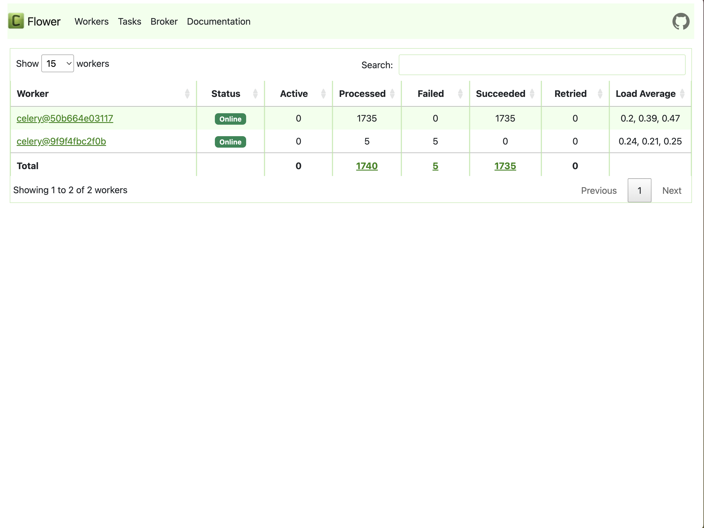

## Introduction

`Celery` is a simple, flexible, and reliable distributed task queue system widely used for handling parallel tasks. In Airflow, `CeleryExecutor` is a popular choice that distributes tasks across multiple nodes (workers), enabling distributed deployment. This architecture allows Airflow to scale its processing power by adding more workers, effectively managing large-scale data pipelines and ensuring tasks are completed on time. Using Docker Compose to set up Airflow with `CeleryExecutor` provides a flexible and manageable solution for varying workloads.

## Prerequisites

* Ensure the existing Airflow service is accessible by the worker.
* We will use the `docker-compose.yaml` file provided on the Airflow website. By editing this configuration file, we can add an extra worker to an existing Airflow service based on `CeleryExecutor`.
* Ensure the worker node can synchronize the contents under the `dags/` directory with the main node. If the worker node doesn't have the correct DAG files, tasks will fail to run!

## Edit the Configuration

### Remove Redundant Components

Since we only want to add an extra worker to the existing Airflow service, there's no need for additional `Postgres`, `Redis`, `Scheduler`, `Trigger`, `Webserver`, or `Flower` components. Therefore, we can remove these components from the `docker-compose.yaml` file.

Additionally, because we won't start new `Postgres` and `Redis` services, we should remove the `depends_on` sections from the `docker-compose.yaml` file to prevent errors.

### Configure Connections

Edit the `x-airflow-common - environment` section to set the necessary environment variables so that the worker can access the existing `Postgres` and `Redis`.

```yaml
x-airflow-common:
  &airflow-common
  image: ${AIRFLOW_IMAGE_NAME:-apache/airflow:2.10.0}
  environment:
    &airflow-common-env
    AIRFLOW__CORE__EXECUTOR: CeleryExecutor
    AIRFLOW__DATABASE__SQL_ALCHEMY_CONN: postgresql+psycopg2://airflow:airflow@<airflow_ip>:<postgres port>/airflow
    AIRFLOW__CELERY__RESULT_BACKEND: db+postgresql://airflow:airflow@<airflow_ip>:<postgres port>/airflow
    AIRFLOW__CELERY__BROKER_URL: redis://:@1<airflow_ip>:<redis port>/0
```

### Edit `.env`

As we did in [the previous article](https://dstipscafe.github.io/blogs/p/hosting_airflow_docker_compose/), we need to set `AIRFLOW_UID` before starting the service:

```shell
echo -e "AIRFLOW_UID=$(id -u)" > .env
```

### Start the Worker

We can start the worker with the following command:

```shell
docker-compose up -d
```

### Check Worker Status

We can verify whether the worker has connected to the existing service. Launch the `Flower` web UI to check the status. If the worker is successfully connected, the page should show two workers:




Please make sure the worker node has synchronized the `dags/` directory with the main node to avoid task failures!

