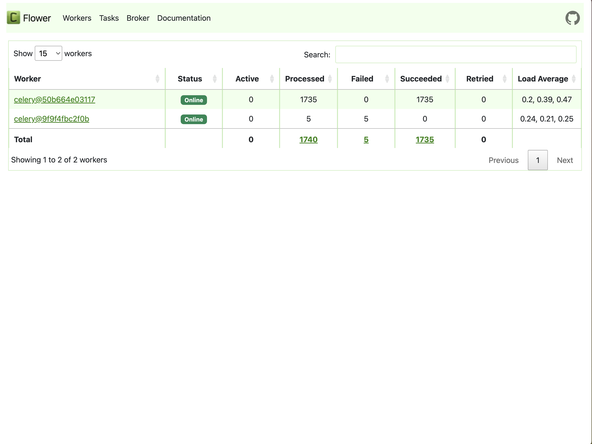

## 簡介

`Celery`是一個簡單、靈活且可靠的分佈式任務佇列系統，廣泛用於處理並行任務。在Airflow中，`CeleryExecutor`是一個受歡迎的選擇，它能夠將任務分佈到多個節點（Workers）上，從而實現分佈式部署。這種架構使Airflow能夠通過增加更多的Worker來增加系統的處理能力，從而有效管理大規模數據管道，並確保任務在指定的時間內完成。使用Docker Compose架設帶有`CeleryExecutor`的Airflow提供了一個靈活且可管理的解決方案，以應對不同的工作負載。

## 先決條件

* 請確保現有的Airflow服務可以被worker訪問。
* 我們將使Airflow網站提供的`docker-compose.yaml`文件。通過編輯該配置文件，我們可以為現有的基於`CeleryExecutor`的Airflow服務添加一個額外的worker。

## 編輯設定

### 移除冗餘組件

由於我們只想為現有的Airflow服務添加一個額外的worker，因此不需要額外的`Postgres`、`Redis`、`Scheduler`、`Trigger`、`Webserver`和`Flower`組件，所以我們可以將這些組件從 `docker-compose.yaml`文件中移除。

此外，由於我們不會啟動新的`Postgres`和`Redis`服務，因此需要移除`docker-compose.yaml`文件中的`depends_on`部分，以防止發生錯誤。

### 設定連線

編`x-airflow-common - environment`部分的環境變數。請填寫必要的資訊，以便`worker`可以訪問既有的`Postgres`和`Redis`。

```yaml
x-airflow-common:
  &airflow-common
  image: ${AIRFLOW_IMAGE_NAME:-apache/airflow:2.10.0}
  environment:
    &airflow-common-env
    AIRFLOW__CORE__EXECUTOR: CeleryExecutor
    AIRFLOW__DATABASE__SQL_ALCHEMY_CONN: postgresql+psycopg2://airflow:airflow@<airflow_ip>:<postgres port>/airflow
    AIRFLOW__CELERY__RESULT_BACKEND: db+postgresql://airflow:airflow@<airflow_ip>:<postgres port>/airflow
    AIRFLOW__CELERY__BROKER_URL: redis://:@1<airflow_ip>:<redis port>/0
```

### 編輯`.env`

就像我們在[前一篇文章](https://dstipscafe.github.io/blogs/p/hosting_airflow_docker_compose/)中所做的一樣，我們需要在啟動服務前設定`AIRFLOW_UID`：


```shell
echo -e "AIRFLOW_UID=$(id -u)" > .env
```

### 啟動Worker

我們可以通過以下命令啟動worker：

```shell
docker-compose up -d
```

### 檢查 worker 狀態

我們可以檢查worker是否已連接到現有服務。請啟動`Flower`網頁以查看狀態。如果worker成功連接到現有服務，網頁中應存在兩個worker：
