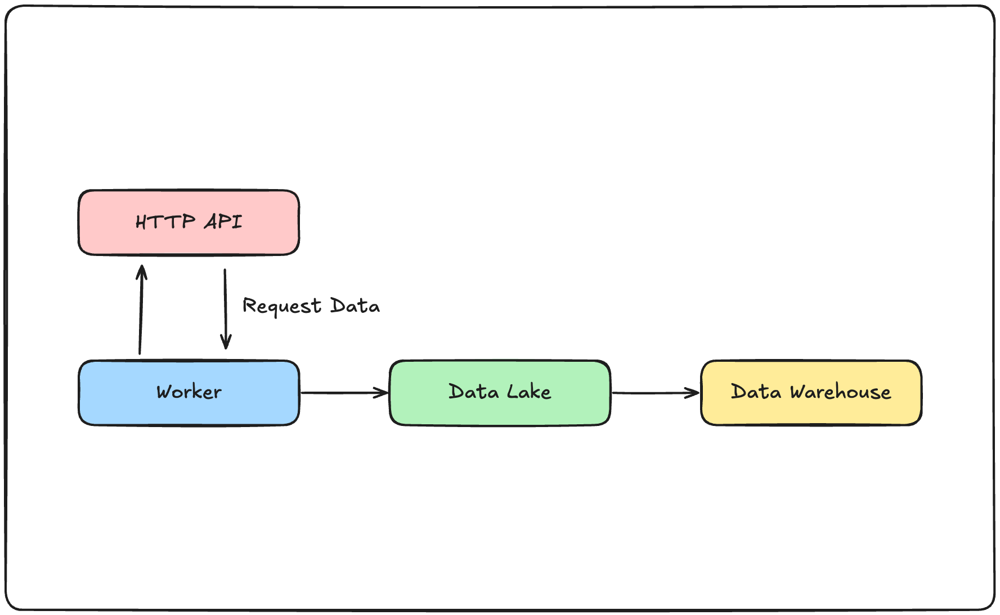

## Introduction

Using Airflow to orchestrate data pipelines is common.  This post explores a scenario where weather data is fetched from an API and stored in the cloud without writing custom `PythonOperator`s.  We rely only on the operators provided by **AWS** and **GCP**.



## Data Source

The example uses Taiwan's Central Weather Administration open API.  You must apply for a token on the [official site](https://opendata.cwa.gov.tw/) before running the DAG.

## AWS

We use **Amazon S3** as the data lake and **Redshift** as the warehouse.

### Fetching Data

`HttpToS3Operator` wraps the process of requesting the API and saving the response to S3:

```python
from airflow import DAG
from airflow.models import Variable
from airflow.providers.amazon.aws.transfers.http_to_s3 import HttpToS3Operator

with DAG(...):
    token = Variable.get('cwa_auth_token')
    s3_bucket_name = Variable.get('s3-dev-bucket-name')
    get_recent_weather_task = HttpToS3Operator(
        task_id='get_weather_to_s3',
        http_conn_id="cwa_real_time_api",
        endpoint="/api/v1/rest/datastore/O-A0003-001",
        method="GET",
        data={
            'Authorization': f'{token}',
            'format': "JSON",
        },
        headers={"Content-Type": "application/json"},
        log_response=True,
        s3_bucket=f"{s3_bucket_name}",
        s3_key="weather_record/weather_report_10min-{{ execution_date }}_v2.json",
        aws_conn_id="aws_s3_conn",
    )
```

### S3 to Redshift

Before copying data into Redshift you must create the serverless instance (or cluster), schema and table, and register connection info in Airflow.  `S3ToRedshiftOperator` then issues a `COPY` command:

```python
from airflow.providers.amazon.aws.transfers.s3_to_redshift import S3ToRedshiftOperator

s3_to_redshift = S3ToRedshiftOperator(
    task_id='s3_to_redshift',
    redshift_conn_id="redshift_conn",
    aws_conn_id="aws_s3_conn",
    s3_bucket=s3_bucket_name,
    s3_key="<your file name>",
    schema="<your schema>",
    table="<your table>",
    method="<your method>",
)
```

You may supply a `jsonpaths.json` file if you only need part of the JSON structure.

## GCP

For Google Cloud we upload files to GCS and move them into BigQuery with `GCSToBigQueryOperator`:

```python
from airflow.providers.google.cloud.transfers.gcs_to_bigquery import GCSToBigQueryOperator

PROJECT_ID = "<your gcp project id>"
DATASET_NAME = "<your dataset name>"
TABLE_NAME = "<your table name>"

gsc_to_bq_task = GCSToBigQueryOperator(
    task_id='gcs_to_bq_task',
    bucket=Variable.get("gcs-landing-bucket"),
    source_objects=["weather_report_10min-{{ execution_date }}.json"],
    destination_project_dataset_table=f"{PROJECT_ID}.{DATASET_NAME}.{TABLE_NAME}",
    source_format='NEWLINE_DELIMITED_JSON',
    write_disposition="WRITE_APPEND",
    ignore_unknown_values=True,
    autodetect=False,
)
```

`GCSToBigQueryOperator` can also define the schema inline without a separate JSON file, offering more flexibility than the AWS counterpart.

## Summary

AWS provides convenient tools like `HttpToS3Operator`, while GCP's `GCSToBigQueryOperator` offers flexible schema handling and table creation.  Choosing between them depends on your needs and willingness to write custom operators.  If you enjoy the article, consider buying me a coffee!

<a href="https://www.buymeacoffee.com/ds_cafe_and_tips"></a>
