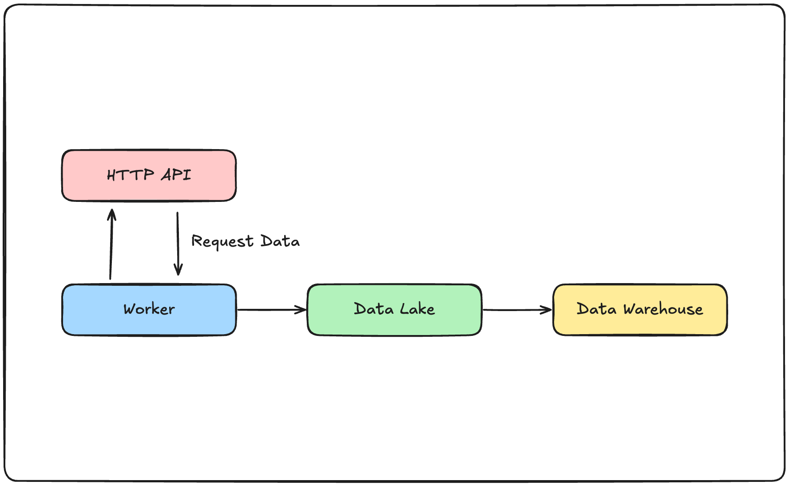

## 簡介

在網路爬蟲與資料搜集中，通過向既有的API索取資料，並儲存至資料湖，並更近一步的整理至資料倉儲是一個很常見的資料管線。達成這一流程的方法很多，在使用Airflow建構資料管線上，無論是使用`PythonOperator`自己建構任務，或是使用社群提供的各個`Operator`都能達成任務。今天我們將來淺談一下，若是在盡量不使用自訂的`PythonOperator`的前提下，僅使用**AWS**以及**GCP**的`Operator`進行資料的索取以及上傳，會需要做些什麼，或是會遇到什麼問題。以下是我們的假設情境示意圖：



## 資料來源

在這次的示範中，我們將使用台灣氣象署的公開API服務，使用上需要申請一組`Token`，若有興趣嘗試者，請自行至[網站](https://opendata.cwa.gov.tw/)註冊並取得`Token`。

## AWS

在AWS方面，我們可以使用`AWS S3`作為資料湖，並使用`AWS Redshift`作為資料倉儲。

### 取得資料

在Airflow的工具中，有`HttpToS3Operator`可以協助我們把向API索取資料，並且上傳至指定`S3`容器的流程包裝成一個動作。以下是一個範例：

```python
from airflow import DAG
from airflow.models import Variable
from airflow.providers.amazon.aws.transfers.http_to_s3 import HttpToS3Operator

with DAG(...):
    token = Variable.get('cwa_auth_token')
    s3_bucket_name = Variable.get('s3-dev-bucket-name')
    get_recent_weather_task = HttpToS3Operator(
        task_id='get_weather_to_s3',
        http_conn_id="cwa_real_time_api",
        endpoint="/api/v1/rest/datastore/O-A0003-001",
        method="GET",
        data={
            'Authorization': f'{token}',
            'format': "JSON",
        },
        headers={"Content-Type": "application/json"},
        log_response=True,
        s3_bucket=f"{s3_bucket_name}",
        s3_key="weather_record/weather_report_10min-{{ execution_date }}_v2.json",
        aws_conn_id="aws_s3_conn",
    )

```

這部分相當的方便，等於是可以省去先使用`HTTPOperator`取得資料，再使用自訂的`PythonOperator`搭配`boto3`上傳到`S3`的兩步驟流程。

### 將資料轉移至Redshift

針對「自`S3`轉移資料至`Redshift`」這個動作來說，有幾個前置動作需要處理。以下是必要的幾個動作：

1. 建立`Redshift Serverless`或是`Redshift Cluster`
2. 建立對應的`Schema`以及`Table`
3. 將`Redshift`的連線資訊，以及對應的使用者資訊寫入Airflow的連線資料以供後續使用。

在AWS所提供的Airflow工具中，`S3ToRedshiftOperator`可以協助我們使用`COPY`的方式將資料從`S3`搬運至`Redshift`；由於是`COPY`，所以必須先建立好對應的資料表才能正常運作。以下是一個範例：

```python
from airflow import DAG
from airflow.models import Variable
from airflow.providers.amazon.aws.transfers.http_to_s3 import HttpToS3Operator
from airflow.providers.amazon.aws.transfers.s3_to_redshift import S3ToRedshiftOperator

with DAG(...):
    # ...

    s3_to_redshift = S3ToRedshiftOperator(
        task_id='s3_to_redshift',
        redshift_conn_id="redshift_conn",
        aws_conn_id="aws_s3_conn",
        s3_bucket=s3_bucket_name,
        s3_key="<your file name>",
        schema="<your schema>",
        table="<your table>",
        method="<your method>",
    )
```

如果希望只取用部分的資料，可以使用`jsonpaths.json`檔案來宣告對應的資料位置，並作為`COPY`的選項提供給`S3ToRedshiftOperator`。假設我們索取的的資料結構如下：

```json
{
    "success": "...",
    "result": "...",
    "records": {
        "Station": [
            {
                "StationName": "<StationName>",
                "StationId": "<StationId>",
                "...": "..."
            },
            {
                "StationName": "<StationName>",
                "StationId": "<StationId>",
                "...": "..."
            }
        ]
    }
}

```

若我們希望只取出列表中第一個元素的`StationName`以及`StationId`並存放到`Redshift`的資料表中，我們可以建立以下的`jsonpaths.json`，並放置在`S3`的容器中：

```json
{
  "jsonpaths": [
    "$['records']['Station'][0]['StationName']",
    "$['records']['Station'][0]['StationId']"
  ]
}
```


```python
from airflow import DAG
from airflow.models import Variable
from airflow.providers.amazon.aws.transfers.http_to_s3 import HttpToS3Operator
from airflow.providers.amazon.aws.transfers.s3_to_redshift import S3ToRedshiftOperator

with DAG(...):
    # ...

    s3_to_redshift = S3ToRedshiftOperator(
        task_id='s3_to_redshift',
        redshift_conn_id="redshift_conn",
        aws_conn_id="aws_s3_conn",
        s3_bucket=s3_bucket_name,
        s3_key="<your file name>",
        schema="<your schema>",
        table="<your table>",
        method="<your method>",
        copy_options=["JSON 's3://<path to your jsonpaths.json>'"],
    )
```

> 通常我們會把`jsonpaths.json`放在`S3`的容器中，但這不是唯一的做法。


### AWS小結以及已知問題

透過這`HttpToS3Operator`以及`HttpToS3Operator`，我們完成透過HTTP取得資料，並依序存放至資料湖以及資料倉儲。但目前已知有一個問題：假設特定JSON欄位是一個列表的資料形式，以目前的`jsonpaths.json`，無法透過使用`[*]`的方法來配對所有的內部元素。此外，在AWS所提供的功能中，不能在搬運資料的同時建立對應的資料表，而必須先建立好對應的資料表。

## GCP

在AWS方面，我們可以使用`Google Cloud Storage`作為資料湖，並使用`BigQuery`作為資料倉儲。

### 取得資料

在GCP所提供的Airflow工具中，並沒有類似AWS的`HttpToS3Operator`協助我們將資料的請求以及到資料湖之間的傳輸簡化為一個步驟。我們可以透過使用`PythonOperator`搭配`HTTPOperator`來達成資料的請求以及上傳的任務。以下是範例：

```python
import json
import boto3

from botocore.exceptions import ClientError

from airflow import DAG
from airflow.models import Variable
from airflow.providers.http.operators.http import HttpOperator
from airflow.decorators import task
from airflow.utils.trigger_rule import TriggerRule
from datetime import datetime, timedelta

@task(task_id='upload_s3', trigger_rule=TriggerRule.ONE_SUCCESS, retries=3, retry_delay=timedelta(minutes=1))
def upload_s3(ti, **context):
    s3_id = Variable.get('s3-side-project-id')
    s3_key = Variable.get('s3-side-project-key')
    s3_bucket_name = Variable.get('s3-dev-bucket-name')
    s3_region_name = Variable.get('s3-default-region')
    
    data = ti.xcom_pull(task_ids='ping_cwa_api_task')
    data = json.loads(data)
    
    s3 = boto3.client(
        's3',
        region_name=s3_region_name,
        aws_access_key_id=s3_id,
        aws_secret_access_key=s3_key,
    )
    
    try:

        file_key = f'weather_report_10min-{execution_date}.json'
        s3.put_object(
            Body=json.dumps(data),
            Bucket=s3_bucket_name,
            Key=file_key
        )
        return file_key
        
    except ClientError as e:
        raise e

with DAG(...):
    token = Variable.get('cwa_auth_token')
    s3_bucket_name = Variable.get('s3-dev-bucket-name')

    get_data_task = HttpOperator(
        task_id='get_data_task',
        http_conn_id='cwa_real_time_api',
        endpoint="/api/v1/rest/datastore/O-A0003-001",
        method="GET",
        data={
            'Authorization': f'{token}',
            'format': "JSON",
        },
        headers={"Content-Type": "application/json"},
        log_response=True,
    )

    get_payload >> upload_s3()
```

### 將資料轉移至BigQuery

接下來，我們可以使用GCP所提供的`GCSToBigQueryOperator`來將位於`GCS`中的JSON檔案轉移至`BigQuery`中。在這邊，我們假設對應的`BigQuery Dataset`已經存在，但我們要寫入的表並未存在。以下是使用`GCSToBigQueryOperator`搬運資料的範例：

```python
# ... import dependencies

# ... upload task

with DAG(...):
    # ...

    PROJECT_ID = "<your gcp project id>"
    DATASET_NAME = "<your dataset name>"
    TABLE_NAME = "<your table name>"  

    gsc_to_bq_task = GCSToBigQueryOperator(
        task_id='gcs_to_bq_task',
        bucket=Variable.get("gcs-landing-bucket"),
        source_objects=["weather_report_10min-{{ execution_date }}.json"],
        destination_project_dataset_table=f"{PROJECT_ID}.{DATASET_NAME}.{TABLE_NAME}",
        source_format='NEWLINE_DELIMITED_JSON',
        write_disposition="WRITE_APPEND",
        ignore_unknown_values=True,
        autodetect=False,
    )

    get_payload >> upload_s3() >> gsc_to_bq_task


```

同樣的，若是我們希望對資料的部分內容做篩選，我們可以使用`GCSToBigQueryOperator`所提供的`schema_fields`參數，直接宣告希望篩選的結構，不需要額外撰寫並上傳`jsonpaths.json`檔案。

```python
# ... import dependencies

# ... upload task

with DAG(...):
    # ...

    PROJECT_ID = "<your gcp project id>"
    DATASET_NAME = "<your dataset name>"
    TABLE_NAME = "<your table name>"  

    gsc_to_bq_task = GCSToBigQueryOperator(
        task_id='gcs_to_bq_task',
        bucket=Variable.get("gcs-landing-bucket"),
        source_objects=["weather_report_10min-{{ execution_date }}.json"],
        destination_project_dataset_table=f"{PROJECT_ID}.{DATASET_NAME}.{TABLE_NAME}",
        source_format='NEWLINE_DELIMITED_JSON',
        schema_fields=[
            {
                "name": "records", 
                "type": "RECORD", 
                "mode": "REPEATED",
                "fields": [
                    {
                        "name": "Station", 
                        "type": "RECORD", 
                        "mode": "REPEATED",
                        "fields": [
                            {"name": "StationName", "type": "STRING", "mode": "Required"},
                            {"name": "StationId", "type": "INTEGER", "mode": "Required"},
                        ],
                    },

                ],
            },
        ],
        write_disposition="WRITE_APPEND",
        ignore_unknown_values=True,
        autodetect=False,
    )

    get_payload >> upload_s3() >> gsc_to_bq_task

```

這點相較於AWS所提供的`S3ToRedshiftOperator`來說，方便許多，且提供了更彈性的設定方式，個人對此評價頗高。

> 如果有需要在DAG內加入建立`BigQuery Dataset`的任務，可以使用`BigQueryCreateEmptyDatasetOperator`來達成。

### GCP小結

在GCP所提供的Airflow工具中，雖然沒有像AWS所提供的`HttpToS3Operator`可以協助我們將資料的取得以及上傳流程進行簡化，但提供了更便利且彈性的`GCSToBigQueryOperator`讓我們將資料篩選並轉移至資料倉儲之中。且GCP的`GCSToBigQueryOperator`可以在資料表不存在的狀況下直接建立資料表，相對於AWS的解決方案要來得更便利。

## 小結

在這篇文章中，我們簡單的介紹了在一個常見的場景下，可以如何透過Airflow搭配AWS以及GCP所提供的工具來建構資料管線，並且介紹了各自工具所提供的優點以及缺點。簡單總結一下雙方的好處：

* AWS
  * 提供`HttpToS3Operator`，簡化資料取得以及上傳的流程
  * `S3ToRedshiftOperator`使用上較不彈性，略遜於`GCSToBigQueryOperator`
* GCP
  * 並未提供類似`HttpToS3Operator`的便捷功能，需要自行撰寫`PythonOperator`搭配`HttpOperator`
  * `GCSToBigQueryOperator`提供了較為彈性且方便設定的功能，使用體驗較佳
  
有人或許會說，「你所提到的這些問題都可以藉由撰寫`PythonOperator`進行客製化來處理掉」。然而自己寫的`PythonOperator`需要額外的測試，而既有的工具是已經經過測試的，且能夠相容於對應的Airflow版本，在使用的相容性以及維護方面具有一定程度的優勢。

如果覺得我的文章對你有幫助，歡迎請我喝一杯咖啡～


<a href="https://www.buymeacoffee.com/ds_cafe_and_tips"></a>