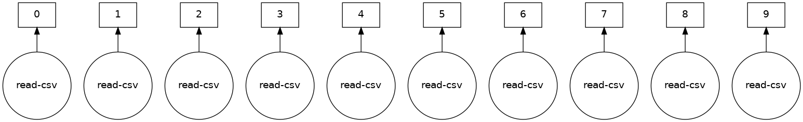

## 前言

在大數據的分析場景中，需要讀取大量數據至程式中，並進行處理的場景是非常常見的。想必對於熟悉Pandas的使用者來說，使用For迴圈不斷地把新的數據添加至既有的資料表格中的操作也是習以為常的處理手段。使用For迴圈來依序將所有資料讀取到程式中的做法，雖然沒什麼問題，但根據資料量的多寡，可能會需要相當多的時間來處理。對於這種情況，`Dask`就是一個非常好用的工具。`Dask`完全相容Numpy以及Pandas的操作，並提供平行化的資料讀取以及數據處理的功能。本文將會介紹如何使用Dask來簡化大量CSV檔案的讀取流程。

## 回顧Pandas

在介紹Dask的解決方案前，我們可以先回顧如何使用Pandas進行大量資料的讀取。假設在路徑`data`之中有一組上百筆的CSV檔案，檔案名稱如下：

```
# ls data
467440-2020-01-01.csv
467440-2020-01-02.csv
467440-2020-01-03.csv
467440-2020-01-04.csv
467440-2020-01-05.csv
...(略)
```

在使用Pandas的前提下，依序讀取這些資料的流程將會是：

```python
import pandas as pd
from glob import glob

file_list = sorted(glob("./data/*.csv"))

df = pd.DataFrame()

for _file_path in file_list:
    tmp_df = pd.read_csv(_file_path)
    df = pd.concat([df, tmp_df], ignore_index=True)
```

在上方的程式碼中，我們使用`glob`來取得`data`目錄中的所有CSV檔案名稱，並使用`sorted`來對其進行排序。在讀取前，先創建一個空的資料表。接下來，使用for迴圈依序的讀取CSV檔案，並將其添加至先前所創建的資料表之中。這種方法非常直觀，但有以下幾個問題：

1. 需要先創建一個空資料表，方能使用`concat`方法來將資料一一的添加至資料表中。
2. 當檔案數量非常大時，for迴圈將耗費大量時間來讀取資料。

當然，也可以不先建立空資料表物件，使用`if`搭配`enumerate`來針對第一筆資料的讀取行為進行設定，但這做法將令整個讀取流程更加緩慢。（因為需要做額外的`if...else`判斷。） 

## Dask簡介

[Dask](https://www.dask.org/)是一個提供平行化以及分散式計算功能的Python套件。其設計核心為使用**惰性計算（Lazy Evaludation）**，透過不在程式碼被執行的當下就進行計算來減少計算量，並提高整體效率。在Dask的使用上，使用者撰寫的程式碼都不會在第一時間被計算，直到使用者使用`.compute()`才會進行所有的處理。這樣的好處在於，所有的運算，視使用者的撰寫流程，可以大幅度地降低記憶體的使用，並使數據的操作可以被平行化的處理。舉例來說，使用Dask可以使用平行化來一次性將所有的CSV資料讀取至記憶體中，再進行合併。又或是可以修改以往的操作流程，不是先將所有的資料讀取後，再進行資料操作；而是在每一個檔案被讀取時，就先做一些處理，最後再將資料進行合併。

## 如何使用Dask快速讀取大量資料？

接下來是一個簡單的範例，示範如何使用`Dask`來進行資料的讀取：

```python
import dask.dataframe as dd
from glob import glob

file_list = sorted(glob("./data/*.csv"))

df = dd.read_csv(file_list).compute()
```

可以發現使用Dask讀取資料的流程相當簡便，只需要將帶有所有資料夾路徑的串列傳遞給`read_csv`函數，並使用`.compute()`方法，即可讀取所有資料。`Dask`所提供的`Dask.dataframe`基本上完全相容`Pandas`的操作。使用者也可以考慮先做好一系列的計算流程編寫，再使用`.compute()`進行處理。

## 查看Dask的處理流程

Dask套件有提供一個視覺話化功能(`.vizusalize()`方法)，可以讓使用者了解在Dask的架構下，所有的運算是以何種流程來進行的。要進行視覺化，必須要先安裝`graphviz`才可以使用。我們可以將上一章節的範例進行視覺話，來了解Dask是如何處理這些檔案的。（為了視覺效果，僅讀取十個檔案。）

```python
import dask.dataframe as dd
from glob import glob

file_list = sorted(glob("./data/*.csv"))

df_instance = dd.read_csv(file_list[:10])

df_instance.visualize()
```

Dask將會回傳一張圖片，將運算的流程展示給使用者。



必須注意的事情，只有尚未使用`.compute()`進行計算的物件，才可以使用`.visualize()`進行運算流程的視覺化。

## 重點摘要

在本文中，我們介紹了非常強大的平行化資料處理套件——`Dask`。透過使用`Dask`，我們可以：

1. 簡化並加速資料讀取流程
2. 透過平行化處理來加速資料的讀取以及處理
3. 透過惰性計算來減少計算量

在使用Dask時，需要注意：所有的計算在`.compute()`被呼叫之前，都不會進行求值。