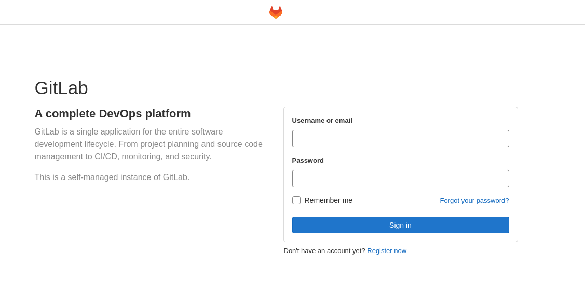
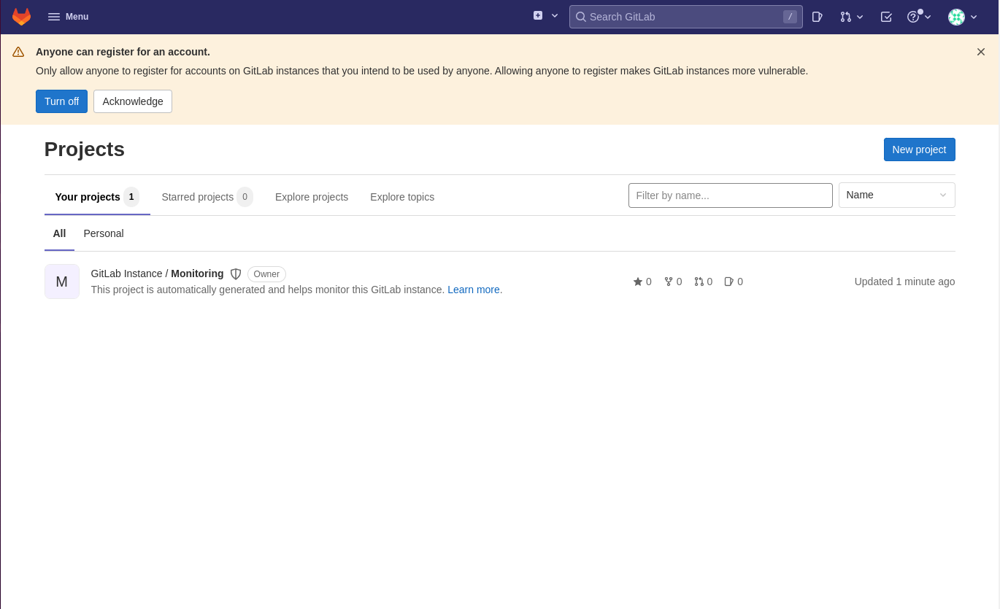

## 前言

DevOps已經是軟體以及大數據時代人盡皆知的一個概念，也以此為基礎發展出了各種不同的應用還有衍伸，例如**DevSecOps**、**DataOps**以及**MLOps**等等。在架設自己的HomeLab時，考慮到有些自己要部署的功能以及服務實在有太多機密性以及隱私性，所以興起了在地端的環境中自架GitLab以及CI/CD環境的想法。我將在以此篇文章為開始的系列文中，介紹我是如何透過Docker來建立自己的CI/CD環境。

## 軟硬體需求

### 硬體

1. CPU：桌面平台CPU即可。
2. 記憶體：建議8GB以上。
3. 容量：根據需求而定。

### 軟體以及作業系統

* 能運行Docker的作業系統
* Docker-ce
* Docker-ce-cli
* Docker-compose


因為我們使用Docker進行架設，故對作業系統要求不高。若要直接安裝於系統之中，請參考官方的[安裝指南](https://about.gitlab.com/install/)。


## 安裝步驟

我將使用虛擬環境來示範如何從零開始自架GitLab。首先建立一個具有四核心以及20GB記憶體空間的`Ubuntu 20.024`虛擬機。讀者可以依照自己喜好，自行更換為熟悉的系統。在虛擬機準備好後，我們需要安裝Docker以及必要的軟體。


請務必將以下教學中的/path/to/your前綴更改成讀者自身所設定的位置。


```shell
sudo apt-get -y update
sudo apt-get -y upgrade
sudo apt-get install -y git \ 
                        wget \ 
                        curl \ 
                        qemu-guest-agent \
                        apt-transport-https \
                        ca-certificates \    
                        gnupg \
                        lsb-release
                        
curl -fsSL https://download.docker.com/linux/ubuntu/gpg | sudo gpg --dearmor -o /usr/share/keyrings/docker-archive-keyring.gpg
echo \
  "deb [arch=amd64 signed-by=/usr/share/keyrings/docker-archive-keyring.gpg] https://download.docker.com/linux/ubuntu \
  $(lsb_release -cs) stable" | sudo tee /etc/apt/sources.list.d/docker.list > /dev/null

sudo apt-get update
sudo apt-get install docker-ce=5:19.03.9~3-0~ubuntu-focal docker-ce-cli=5:19.03.9~3-0~ubuntu-focal containerd.io docker-compose
```

## 編寫Docker-Compose設定檔案

要在地端環境中自架GitLab以及相關的CI/CD元件，需要同時存在好幾個容器來達成。本文將只介紹如何架設GitLab，但為了後續的部分，將直接使用Docker-Compse來進行設定。

為了能夠在主系統也能更改GitLab的相關設定，所以必須將主系統的一個資料夾掛載至容器內以便存取容器內部資訊。另外，為了能使GitLab能與Docker服務進行溝通以及調控，需要將把主系統的/var/run/docker.sock掛載至容器當中。另外，因為GitLab網站是基於網頁的服務，故設定時必須將容器的80以及443連接埠與主系統的對外連接埠相連接。

以下是一個範例的設定，請記得將`/path/to/your`部分改為自己的設定。

```yaml
version: '3.5'
services:
  gitlab:
    image: gitlab/gitlab-ce
    hostname: gitlab.me
    container_name: gitlab-main
    restart: always
    environment:
      GITLAB_OMNIBUS_CONFIG: |
        external_url "http://gitlab.me"
        letsencrypt['enable'] = false
    volumes:
      - /path/to/your/gitlab/config:/etc/gitlab
      - /path/to/your/gitlab/logs:/var/log/gitlab
      - /path/to/your/gitlab/data:/var/opt/gitlab
      - /path/to/your/var/run/docker.sock:/var/run/docker.sock
    ports:
      - '443:443'
      - '80:80'
    extra_hosts:
      - "gitlab.me:192.168.0.101"
    networks:
      - devops-net
networks:
  devops-net:
```

在上方的設定中，我指定了一個容器用以承載GitLab服務，並將將對應的設定資料掛載至主機的`/path/to/your/gitlab`資料夾之下，同時將主機的`80/443`連接埠與容器的`80/443`連接埠進行對接。在此我們暫時先不設定HTTPS以及SSL加密。

## 啟動容器

在完成設定後，只需要在`docker-compose.yml`所在的資料夾執行以下指令即可建立GitLab服務，並使其在背景執行。

```shell
docker-compose up -d
```

在啟動容器後，等候約3分鐘左右，就可以透過`http://<主機IP>`來連線到架設好的GitLab網站了。




在設定檔案中，我們使用了`external_url`來設定GitLab的域名。如果要在地端使用這個域名，需要至`/etc/hosts`檔案增加一行`<主機IP> gitlab.me`用以讓系統得知`<主機IP>`即為gitlab.me的Host。


## 登入root帳號

通常在第一次連接時，GitLab頁面會要求更改root密碼並以該密碼進行登入，但偶爾會遇到跳過前述環節直接進入輸入帳號密碼的狀況。此時，我們可以透過掛載在主系統的`/gitlab/config/initial_root_password`中所紀錄的初始root密碼進行登入。



到此，自架GitLab的服務就大功告成拉！

## 延伸閱讀 - 為自架GitLab簽署SSL證書並使主機信任憑證

首先，為了建立自簽SSL證書，必須要先建立一個`ssl_certificate.conf`檔案：

```
[req]
prompt = no
default_md = sha256
default_bits = 2048
distinguished_name = dn
x509_extensions = v3_req

[dn]
[req]
prompt = no
default_md = sha256
default_bits = 2048
distinguished_name = dn
x509_extensions = v3_req

[dn]
C = TW
ST = Taiwan
L = Taipei
O = Boring Corp.
OU = IT Department
emailAddress = admin@gitlab.me
CN = gitlab.me

[v3_req]
subjectAltName = @alt_names

[alt_names]
DNS.1 = gitlab.me
DNS.2 = *.gitlab.me
```

在填寫完`ssl_certificate.conf`檔案之後，使用`openssl`來產生證書：

```shell
openssl req -x509 -new -nodes -sha256 -utf8 -days 3650 -newkey rsa:2048 -keyout server.key -out server.crt -config ssl_certificate.conf
```

此時，資料夾內會產生兩個檔案`server.key`以及`server.crt`。為了讓GitLab服務能夠讀取到相關設定，需要將這兩個檔案複製到指定位置。

```shell
sudo cp server.key /path/to/your/gitlab/config/ssl/gitlab.me.key
sudo cp server.crt /path/to/your/gitlab/config/ssl/gitlab.me.crt
```

在完成設定後，我們還需要更改我們在`docker-compose.yml`中的`external_host`參數，讓連線協議從**HTTP**改為**HTTPS**。

```
#修改前
environment:
  GITLAB_OMNIBUS_CONFIG: |
    external_url "http://gitlab.me"
    letsencrypt['enable'] = false
    
#修改後
environment:
  GITLAB_OMNIBUS_CONFIG: |
    external_url "https://gitlab.me"
    letsencrypt['enable'] = false
```

只需要重新執行`docker-compose up`指令即可套用設定。

接下來，我們需要讓使用的系統信任此憑證。以Ubuntu為例，我們只需要把剛剛產生的`server.crt`下載到系統之中，並將其複製到`/usr/local/share/ca-certificates`資料夾之下，並執行`sudo update-ca-certificates`指令即可使Ubuntu信任我們簽署的證書。

## 小節

利用Docker來建立各式各樣的功能實在是非常方便，對於架設HomeLab的人來說更是省時間又省力氣超級好幫手。我會在接下來的文章中介紹如何啟用`Container Registry`以及如何為GitLab新增`GitLab Runner`。