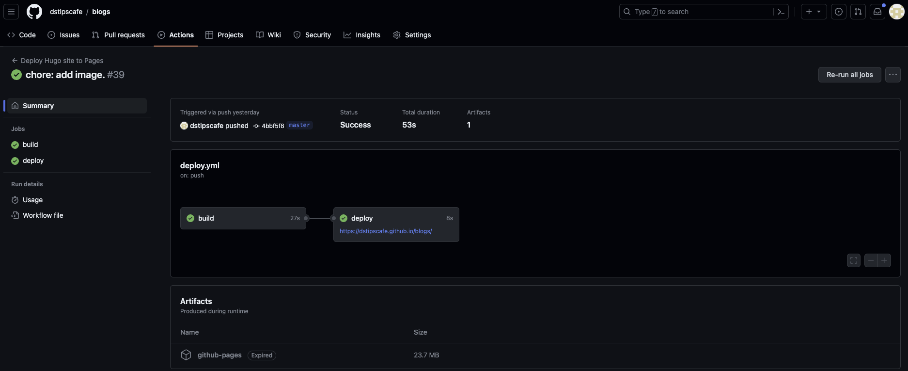

## 前言

這篇文章要來介紹我如何使用Hugo搭配GitHub Action來在Github Pages上建立個人的網站。主要用到的有幾個重要的架構以及工具：

* [Hugo](https://gohugo.io/)：輕量化的網頁架構。
* [GitHub Action](https://github.com/features/actions)：GitHub所提供的DevOps服務。

## 前置準備

首先，你需要先準備好：

1. GitHub帳號：用以使用GitHub服務。
2. SSH公鑰以及私鑰：用以推送更新的程式碼到GitHub伺服器。

在這邊，我們會假設你已經了解如何建立帳號，以及對Git/GitHub有基本的認知。

## 選擇網頁模版

在Hugo的社群中，有許多人分享了他們所設計的模板，我們可以從中挑選一個自己喜歡的樣式作為接下來開發的基礎。

> Hugo主題連結：https://themes.gohugo.io/

我所選擇的主題[Jimmy Cai](https://github.com/CaiJimmy)所分享的**Stack**主題，連結：https://github.com/CaiJimmy/hugo-theme-stack。

## 複製主題

在選擇好主題後，我們可以使用**Fork**來將作者所分享的程式碼複製到自己的GitHub倉庫中。


只要點選右上角的Fork並依填入相應的資訊即可複製一份到自己的倉庫之中。


> 因為我已經建立過**blogs**倉庫了，所以會顯示紅字，請不要在意。

完成後，你應會看到類似以下的畫面：


## 下載倉庫

接下來，我們可以將倉庫的程式碼下載到電腦的環境中，並進行後續的處理。在我的例子中，我可以用以下的指令來進行下載：

```
git clone git@github.com:dstipscafe/blogs.git
```

## 定義GitHub Action

每一個分享的作者可能會有自訂義的GitHub Action流程，協助用戶來快速的佈署自己的網站。在我所選擇的Stack主題中，很不幸的GitHub Action並沒有正常的作用。所以我就找了官方的教學來重新定義相關的流程。以下的教學均出自[官方文件](https://gohugo.io/hosting-and-deployment/hosting-on-github/)。

### 定義建構以及部署的來源

首先，我們需要定義GitHub Pages的來源。請先到**設定>Pages**的頁面中，將**Build and deployment**的選項修改成**GitHub Action**。


### 定義建構流程

GitHub Action的執行流程是由**yaml檔案**所定義的，而這個定義檔案需要被放在`.github/workflows/`資料夾底下。我們可以使用官方所提供的範例：

```yaml
# Sample workflow for building and deploying a Hugo site to GitHub Pages
name: Deploy Hugo site to Pages

on:
  # Runs on pushes targeting the default branch
  push:
    branches:
      - main

  # Allows you to run this workflow manually from the Actions tab
  workflow_dispatch:

# Sets permissions of the GITHUB_TOKEN to allow deployment to GitHub Pages
permissions:
  contents: read
  pages: write
  id-token: write

# Allow only one concurrent deployment, skipping runs queued between the run in-progress and latest queued.
# However, do NOT cancel in-progress runs as we want to allow these production deployments to complete.
concurrency:
  group: "pages"
  cancel-in-progress: false

# Default to bash
defaults:
  run:
    shell: bash

jobs:
  # Build job
  build:
    runs-on: ubuntu-latest
    env:
      HUGO_VERSION: 0.115.4
    steps:
      - name: Install Hugo CLI
        run: |
          wget -O ${{ runner.temp }}/hugo.deb https://github.com/gohugoio/hugo/releases/download/v${HUGO_VERSION}/hugo_extended_${HUGO_VERSION}_linux-amd64.deb \
          && sudo dpkg -i ${{ runner.temp }}/hugo.deb          
      - name: Install Dart Sass
        run: sudo snap install dart-sass
      - name: Checkout
        uses: actions/checkout@v3
        with:
          submodules: recursive
          fetch-depth: 0
      - name: Setup Pages
        id: pages
        uses: actions/configure-pages@v3
      - name: Install Node.js dependencies
        run: "[[ -f package-lock.json || -f npm-shrinkwrap.json ]] && npm ci || true"
      - name: Build with Hugo
        env:
          # For maximum backward compatibility with Hugo modules
          HUGO_ENVIRONMENT: production
          HUGO_ENV: production
        run: |
          hugo \
            --gc \
            --minify \
            --baseURL "${{ steps.pages.outputs.base_url }}/"          
      - name: Upload artifact
        uses: actions/upload-pages-artifact@v1
        with:
          path: ./public

  # Deployment job
  deploy:
    environment:
      name: github-pages
      url: ${{ steps.deployment.outputs.page_url }}
    runs-on: ubuntu-latest
    needs: build
    steps:
      - name: Deploy to GitHub Pages
        id: deployment
        uses: actions/deploy-pages@v2
```

接下來我會簡單解釋上方的定義：

* **on**部分：定義此GitHub Action將會在**main**分支有新的**推送(push)**事件時被觸發。
* **defaults**部分：定義此流程將使用＊＊bash**為基礎執行。
* **jobs**部分：定義這個GitHub Action有幾個任務需要執行。以上方為例，將會有兩個任務，分別為**build**以及**deploy**。

在**build**階段，我們首先安裝了Hugo CLI工具，並依序建立了一些臨時的分支來建構我們的網站。這些臨時的分支並不會被留下來，將會在任務結束後被刪除。在建構完成後，所有的頁面將會被上傳至`public`資料夾。而在**deploy**階段時，將使用`public`資料夾中的頁面來作為網站的內容。

> 每一個主題可能有不同的建構及部署流程，這邊的介紹可以在我的主題中正常運作，若使用其他主題無法正常運作，歡迎留言討論。


### 修改定義

在推送改動前，我們還需要修改網站的一些設定。以這個網站為例，我們需要將`config/_default/config.toml`中的`base_url`改為以下的形式：

```
baseurl = "https://dstipscafe.github.io/blogs"
```

### 提交並推送

在完成修改後，我們需要先將所有的改動進行提交（Commit）並推送（push）至GitHub來觸發GitHub Action。

```
# 新增改動
git add .github/workflows/hugo.yaml
git add config/_default/config.toml

# 提交改動
git commit -m "custom setup."


# 推送改動
git push
```

在推送改動之後，如果沒有錯誤，你應該可以看到倉庫的Action頁面中有類似的內容：



如果沒有錯誤且**deploy**的任務出現網址，就可以點選網址來進到部署好的網站之中囉～

> 如果沒有做任何改動，且與我一樣選擇**Stack**主題，應該會看到與作者所提供的[示範頁面](https://demo.stack.jimmycai.com/)相同的網站。

## 總結

希望大家在看完以上的教學後都能夠順利的利用Hugo以及GitHub Action來建構自己的網站！
