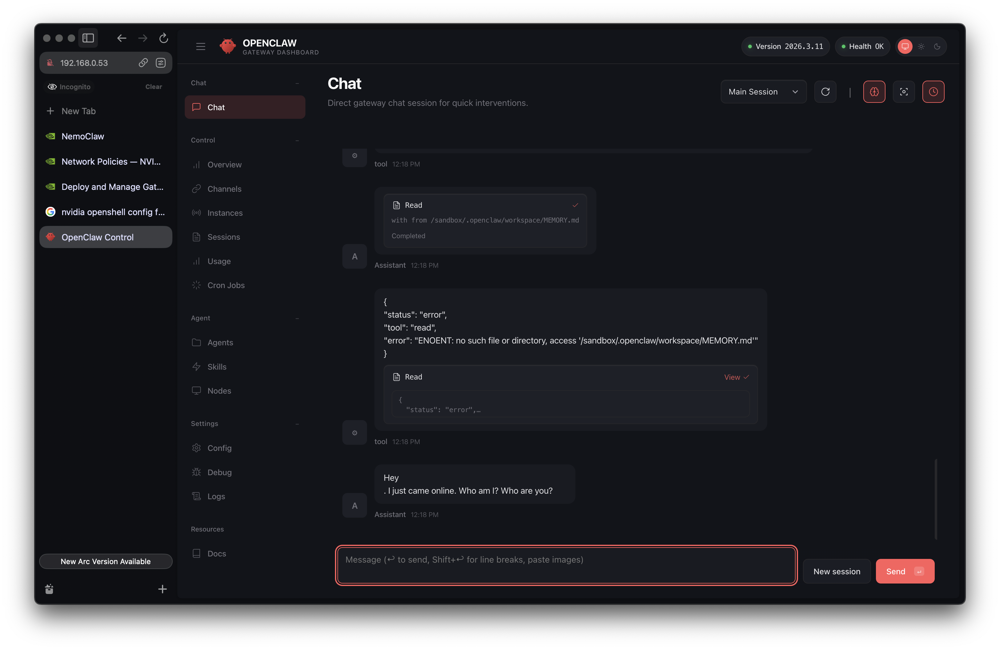

## 簡介

有在追蹤最新AI新知的讀者，肯定有聽說Nvidia最近推出了它們為了安全性以及滿足企業需求所改良的新版本龍蝦，命名為[NemoClaw](https://github.com/NVIDIA/NemoClaw)。今天這篇文章將來教大家如何一步一步的安裝所有需要的工具，並幫你跳過一些因為官方文件沒有提及的坑，讓你能夠在看完這篇教學後，就安裝好自己的NemoClaw開始養龍蝦人生。

## 安裝環境準備

### 硬體準備

根據官方文件，建議的硬體規格為4核心以上，且具有16GB記憶體以及40GB以上的硬碟空間。在本次教學中我們將使用以下設定：

1. 系統：Ubuntu 24.04 (ubuntu-24.04.3-live-server-amd64.iso)
2. CPU：4C2T
3. 記憶體：16GB
4. 硬碟：200GB

為求安裝環境的一致性以及可重復性，我們會使用乾淨的VM來進行安裝。

### 軟體準備

根據官方文件([ref](https://github.com/NVIDIA/NemoClaw?tab=readme-ov-file#software))，要使用NemoClaw，需要安裝以下的軟體：

| Dependency | Version                          |
|------------|----------------------------------|
| Linux      | Ubuntu 22.04 LTS or later |
| Node.js    | 20 or later |
| npm        | 10 or later |
| Container runtime | Supported runtime installed and running |
| [OpenShell](https://github.com/NVIDIA/OpenShell) | Installed |

我們將會在接下來的介紹中一步一步安裝這些軟體。

### 安裝Docker

首先，我們先安裝Docker。Docker的安裝步驟可以參考[官方文件](https://docs.docker.com/engine/install/ubuntu/)的教學。這邊將官方教學的其中一種方式整理在下方，讀者可以直接複製並在指令介面中貼上進行安裝：

```shell
# Add Docker's official GPG key:
sudo apt update -y
sudo apt install -y ca-certificates curl
sudo install -m 0755 -d /etc/apt/keyrings
sudo curl -fsSL https://download.docker.com/linux/ubuntu/gpg -o /etc/apt/keyrings/docker.asc
sudo chmod a+r /etc/apt/keyrings/docker.asc

# Add the repository to Apt sources:
sudo tee /etc/apt/sources.list.d/docker.sources <<EOF
Types: deb
URIs: https://download.docker.com/linux/ubuntu
Suites: $(. /etc/os-release && echo "${UBUNTU_CODENAME:-$VERSION_CODENAME}")
Components: stable
Signed-By: /etc/apt/keyrings/docker.asc
EOF

sudo apt update -y
sudo apt install -y docker-ce docker-ce-cli containerd.io docker-buildx-plugin docker-compose-plugin
```

在成功安裝後，需要使用以下的指令，將使用者加入用戶組，才可以讓使用者以自身的權限（意即不需使用`sudo`指令）來執行`docker`指令：

```shell
sudo chmod 660 /var/run/docker.sock
sudo chown root:docker /var/run/docker.sock
sudo usermod -aG docker $USER
newgrp docker
```

當你可以執行以下指令時，代表docker相關的安裝和設定已經成功完成了。

### 安裝Node.js、nvm以及npm

雖然官方文件並沒有要求nvm，但是通常Node.js以及npm可以跟著nvm一起安裝，一勞永逸。這邊我們會使用[nodejs.org](https://nodejs.org/en/download)所提供的指令來進行安裝。

```shell
# Download and install nvm:
curl -o- https://raw.githubusercontent.com/nvm-sh/nvm/v0.40.4/install.sh | bash

# in lieu of restarting the shell
\. "$HOME/.nvm/nvm.sh"

# Download and install Node.js:
nvm install 24

# Verify the Node.js version:
node -v # Should print "v24.14.0".

# Verify npm version:
npm -v # Should print "11.9.0".
```

> 若有需要調整版本，可以前往[官方網站](https://nodejs.org/en/download)調整版本並取得指令。

### 安裝OpenShell

雖然NemoClaw的安裝會自己處理好OpenShell方面的安裝，但是實際上安裝完之後並沒有辦法在CLI介面中使用`openshell`指令。我們可以根據[官方文件](https://github.com/NVIDIA/OpenShell)來進行安裝：

* 安裝二進位執行檔案

```shell
curl -LsSf https://raw.githubusercontent.com/NVIDIA/OpenShell/main/install.sh | sh
```

* 透過`uv`安裝

```shell
uv tool install -U openshell
```

安裝完成後，將以下這行設定加入你的`.bashrc`或是`.zshrc`中：

```shell
export PATH="/home/user/.local/bin:$PATH"
```

並執行以下指令即可：

```shell
# Bash
source ~/.bashrc

# Zsh
source ~/.zshrc
```

## 安裝NemoClaw

接下來就是重頭戲了。官方提供了一個簡單的指令讓我們可以快速的安裝NemoClaw，基本上在前面的步驟中安裝並設定好需要的軟體的話，這步驟就一定不會出錯了：

```shell
curl -fsSL https://www.nvidia.com/nemoclaw.sh | bash
```

安裝過程可能花費3~5分鐘，請耐心等候。

### Sandbox 設定

在安裝的過程中，安裝工具會跳出以下訊息，讓你設定第一個Sandbox的名稱：

```shell
[3/7] Creating sandbox
──────────────────────────────────────────────────
Sandbox name (lowercase, numbers, hyphens) [my-assistant]:
```

這邊我們可以直接按`Enter`，使用預設的`my-assistant`作為Sandbox的名稱。

### API KEY設定

在安裝過程中，安裝工具會跳出以下訊息請你提供API KEY：

```shell
[4/7] Configuring inference (NIM)
──────────────────────────────────────────────────

┌─────────────────────────────────────────────────────────────────┐
│  NVIDIA API Key required                                        │
│                                                                 │
│  1. Go to https://build.nvidia.com/settings/api-keys            │
│  2. Sign in with your NVIDIA account                            │
│  3. Click 'Generate API Key' button                             │
│  4. Paste the key below (starts with nvapi-)                    │
└─────────────────────────────────────────────────────────────────┘

NVIDIA API Key: <Your API KEY>
```

這邊請前往互動資訊所提供的網址，再註冊Nvidia帳號後，取得API KEY，並貼上到CLI介面中。

### 設定模型

在安裝過程中，安裝工具將會跳出以下訊息詢問你要使用哪一個模型：

```shell
Cloud models:
  1) Nemotron 3 Super 120B (nvidia/nemotron-3-super-120b-a12b)
  2) Kimi K2.5 (moonshotai/kimi-k2.5)
  3) GLM-5 (z-ai/glm5)
  4) MiniMax M2.5 (minimaxai/minimax-m2.5)
  5) Qwen3.5 397B A17B (qwen/qwen3.5-397b-a17b)
  6) GPT-OSS 120B (openai/gpt-oss-120b)

Choose model [1]: 
```

這裡可以選`Nemotron 3 Super 120B (nvidia/nemotron-3-super-120b-a12b)`。目前Nvidia提供免費使用，後續要更換模型也可以另行設定。

### 設定Policy

在安裝的最後一步中，安裝工具會跳出以下訊息詢問你要進行哪些Policy設定。這些Policy是NemoClaw以及OpenShell所提供的最核心功能——「安全隔離」以及「連線限制」。

```shell
[7/7] Policy presets
──────────────────────────────────────────────────

Available policy presets:
  ○ discord — Discord API, gateway, and CDN access
  ○ docker — Docker Hub and NVIDIA container registry access
  ○ huggingface — Hugging Face Hub, LFS, and Inference API access
  ○ jira — Jira and Atlassian Cloud access
  ○ npm — npm and Yarn registry access (suggested)
  ○ outlook — Microsoft Outlook and Graph API access
  ○ pypi — Python Package Index (PyPI) access (suggested)
  ○ slack — Slack API and webhooks access
  ○ telegram — Telegram Bot API access

Apply suggested presets (pypi, npm)? [Y/n/list]:
```

這邊我們可以先回答「Y」，套用預設設定。後續還可以根據需求進行調整。

## 與NemoClaw的第一次邂逅

在安裝完成後，我們就可以開始使用NemoClaw了。NemoClaw是一個主打安全性的OpenClaw變體。其基本上是作為OpenClaw的`Plugin`存在的，但最核心的部分是Nvidia將OpenClaw與其所設計的`OpenShell`結合，讓OpenClaw在隔離的環境中運作，並在隔離環境與實體環境中，為使用者設計一道防火牆，讓使用者可以設定隔離環境中的Agent可以做哪些事情。這邊我們就不詳細介紹架構，直接開始使用NemoClaw吧。首先，我們需要使用以下指令進入我們剛設定好的Sandbox：

```shell
nemoclaw my-assistant connect
```

執行後，CLI環境將進入到Sandbox中，如下所示：

```shell
sandbox@my-assistant:~$
```

### 透過TUI介面與NemoClaw(OpenClaw)互動

接下來我們就可以透過TUI介面與NemoClaw互動了。執行以下指令來啟動TUI:

```shell
openclaw tui
```

指令成功執行後，將會啟動一個TUI介面讓我們與Agent進行互動。我們可以嘗試跟Agent打招呼，如果有收到回應，基本上就代表所有設定都大功告成了：

```shell
🦞 OpenClaw 2026.3.11 (29dc654) — Half butler, half debugger, full crustacean.

openclaw tui - ws://127.0.0.1:18789 - agent main - session main

session agent:main:main

---
hi
---

Hey
. I just came online. Who am I? Who are you?
gateway connected | idle
agent main | session main (openclaw-tui) | inference/nvidia/nemotron-3-super-120b-a12b | tokens 20k/131k (15%)
```

我們可以使用`/exit`指令來離開TUI介面。

## 進階——透過Web UI介面與NemoClaw(OpenClaw)互動

基本上，熟悉Claude Code的讀者或許對TUI介面已經很熟悉了，但是可能有些讀者還是喜歡透過Web UI與Agent進行互動。這個在NemoClaw的設計下當然也是做得到的，不過需要額外多一點點步驟。接下來我們將分為兩種情境，分別進行介紹。

### NemoClaw與你操作的環境在同一個設備

在NemoClaw設定好Sandbox時，基本上會直接使用OpenShell為使用者映射一個主機的連接埠到Sandbox環境中。我們可以在實體環境（Sandbox外）透過`openshell`指令來查看：

```shell
user@nemoclaw:~$ openshell forward list
SANDBOX      BIND      PORT     PID        STATUS
my-assistant 127.0.0.1 18789    23571      running
```

這邊可以注意到，主機的`18789`連接埠與Sandbox環境的`18789`綁定在一起了。接下來我們只需要在Sandbox環境中使用以下指令來啟動一個Web UI介面即可：

```shell
openclaw dashboard
```

OpenClaw將回覆你一組可以用來連線到Web UI的指令，以下是一個示範：

```text
http://127.0.0.1:18789/#token=<token>
```

在NemoClaw與你操作的設備在同一個設備時，只要直接複製這個連結到瀏覽器，就可以連線到Web UI介面了。

### NemoClaw與你操作的環境在不同設備

當我們把NemoClaw安裝在遠端的設備中時，事情就會比較麻煩了。我們有兩種方式可以從遠端連線到遠端的Web UI：

1. 使用SSH Tunnel
2. 使用Nginx容器來進行流量轉發

### 使用SSH Tunnel來連線

使用SSH Tunnel是一個簡單且快速的方式，但壞處就是每次要連線時都要重新啟動一次Tunnel。在OpenClaw啟動Dashboard後的說明就會提供使用者指令，用以使用SSH Tunnel來連線：

```shell
No GUI detected. Open from your computer:
ssh -N -L 18789:127.0.0.1:18789 sandbox@<host>
Then open:
http://localhost:18789/
http://localhost:18789/#token=<token>
Docs:
https://docs.openclaw.ai/gateway/remote
https://docs.openclaw.ai/web/control-ui
```

不過這個方法通常會失敗，因為`sandbox`並不是實體系統中的一個用戶，所以直接執行以上指令無法成功建立連線。比較簡單的做法是使用`VScode`來執行`openclaw dashboard`指令。`VScode`會自動偵測並協助我們將兩個環境的SSH Tunnel串接再一起。這時候就可以使用`openclaw dashboard`所提供的連結登入Web UI介面了。

### 使用Nginx容器來進行流量轉發

基本上，目前NemoClaw的設計還是以在相同的設備上運作為主要設計。根據官方文件也可以部署到遠端的DGX Spark來運作，但目前筆者還沒有購入DGX Spark，所以無從測試。在目前的設計中，我們無法去修改sandbox中的`~/.openclaw/openclaw.json`來允許來自不同裝置的連線，所以如果單純使用`nginx`或去`socat`將`127.0.0.1:18789`的流量綁定到實體網卡，在登入Web UI後將會出現以下錯誤：

```text
origin not allowed (open the Control UI from the gateway host or allow it in gateway.controlUi.allowedOrigins)
```

這時候，我們可以透過一些「小技巧」來騙過OpenClaw的設定，讓他誤以為遠端的流量是來自於相同的裝置。首先，我們需要準備一個`nginx.conf`：

```conf
events {}

http {
    map $http_upgrade $connection_upgrade {
        default upgrade;
        ''      close;
    }

    server {
        listen 0.0.0.0:8888;

        location / {
            proxy_pass http://127.0.0.1:18789;
            proxy_http_version 1.1;

            # WebSocket 支援（Control UI 需要）
            proxy_set_header Upgrade $http_upgrade;
            proxy_set_header Connection $connection_upgrade;

            # 關鍵：改寫 Origin 和 Host，騙過 gateway 的檢查
            proxy_set_header Origin http://127.0.0.1:18789;
            proxy_set_header Host 127.0.0.1:18789;

            # 保留客戶端真實 IP（用於日誌）
            proxy_set_header X-Real-IP $remote_addr;

            # WebSocket 超時設定
            proxy_read_timeout 86400s;
            proxy_send_timeout 86400s;
        }
    }
}
```

在這個設定中，我們做了兩件事：

1. 將`0.0.0.0:8888`的流量轉發至`127.0.0.1:18789`
2. 將header的Origin以及Host資訊修改為`127.0.0.1:18789`

在完成設定後，我們就可以透過以下指令啟動`nginx`的容器：

```shell
docker run -d \
  --name nginx-relay   \
  --network host   \
  --restart unless-stopped   \
  -v $(pwd)/nginx.conf:/etc/nginx/nginx.conf:ro   nginx
```

啟動後，我們就可以透過在瀏覽器輸入`http://<遠端IP>:8888/#token=<token>`來登入位於遠端的NemoClaw的Web UI啦～



> 注意：`docker`容器必須使用`--network host`模式，否則將無法正確轉發流量！
> 目前此方法仍為繞過正常設定的做法，請確保在不將NemoClaw暴露至外網的前提下使用。

## 結語

在這篇文章中，我們簡單的介紹了如何在自己的設備上安裝NemoClaw所需要的軟體，以及如何安裝NemoClaw本身，也介紹了如何在不同環境下連線至NemoClaw的Web UI。如果對這篇文章有興趣，歡迎分享給你的朋友或是其他會有興趣的人～


<a href="https://www.buymeacoffee.com/ds_cafe_and_tips"></a>