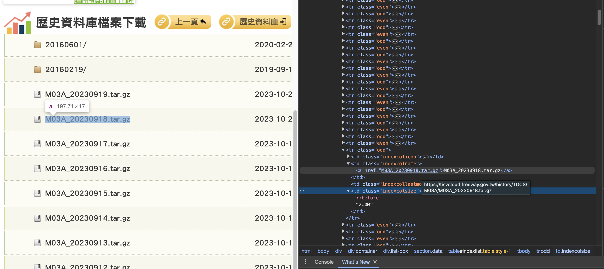

## 前言

在Project Amaterasu中，我們預計將使用台灣的高速公路車流資料。這些資料可以在台灣政府的開放資料網站查詢並下載。我們將在這篇文章中紀錄我們是如何下載，又是如何去整理這些資料的。

## 下載資料

### 前置準備

首先，我們要到交通部的交通資料庫[網站](https://tisvcloud.freeway.gov.tw/)中找尋我們要用的資料。我們需要的是**各類車種通行量統計各類車種**的資料，資料類別為**M03A**。進入**M03A**的資料[頁面](https://tisvcloud.freeway.gov.tw/history/TDCS/M03A/)後，我們可以觀察到可以下載的檔案有兩種類型：

1. 資料夾形式：為近期的歷史資料（以及部分2016年的資料）。


2. 壓縮檔案形式：為一個月以上的單日資料，以壓縮檔案形式提供下載。


在這網站中的資料實在太多，我們如果要一個一個手動下載會耗費非常多的時間與精力。更好的方式是使用程式來自動下載。為了撰寫程式，首先我們可以透過瞭解網頁的元素來解析目標檔案的存放方式，並設計下載的程式。

使用開發者模式後，我們可以發現檔案的存放方式很簡單，連下載方式都很簡單。只要以該網頁的連結加上檔案名稱就可以下載對應的壓縮檔案，實在非常容易。


> 這邊我們邊忽略還沒有變成壓縮檔案的日期，即時資料在這邊暗中並不是如此重要，等到這些資料變成壓縮檔案再下載也不遲。

### 撰寫程式

既然知道檔案的連結，那我們就可以使用Python來撰寫下載的程式了。我們將會需要使用以下幾個Python套件：

* wget: 下載檔案使用
* rich: 顯示進度使用
* pandas: 處理日期以及結構化資料使用。
* concurrent: 使程式碼可以平行或是同步運行。

下載程式的核心程式碼如下所示：

```python
import wget

wget.download(url, out=output_dir)
```

只要使用`wget`搭配連結，並指定輸出的位置，就可以將網路上的檔案下載到電腦中的指定資料夾。

由於檔案數量龐大，我們會希望同時下載多個檔案，這時候就需要`concurrent`套件的協助了。我們將使用`concurrent`套件中的`ThreadPoolExecutor`功能來建立線程池，用以執行我們所指定的任務。

以下是結合了`wget`以及`concurrent`所撰寫的下載程式：

```python
import os
import wget
import pandas as pd

from rich.progress import Progress
from concurrent.futures import ThreadPoolExecutor

def get_tar_file(
    item_name,
    output_dir,
    base_url,
):
    url = f"{base_url}{item_name}"
    try:
        wget.download(url, out=output_dir, bar=None)
    except urllib.error.HTTPError as e:
        if e.code == 404:
            print(f"Archive {item_name} does not exists!")
        else:
            print(f"An error occured! Exception: {e}")

def main():
    base_url = "https://tisvcloud.freeway.gov.tw/history/TDCS/M03A/"

    start_date = '2021-01-01'
    end_date = '2021-02-01'

    output_dir = "./data"
    
    num_workers = 5
    
    dateList = [
        ts.strftime("%Y%m%d")
        for ts in pd.date_range(start_date, end_date, freq="1D")
    ]

    tarfileList = [f"M03A_{date}.tar.gz" for date in dateList]

    download_func = partial(get_tar_file, output_dir=output_dir, base_url=base_url)

    with ThreadPoolExecutor(max_workers=num_workers) as executor:
        with Progress() as progress:
            task1 = progress.add_task("[red]Downloading...", total=len(tarfileList))
            for _ in executor.map(download_func, tarfileList):
                progress.update(task1, advance=1)

if __name__ == '__main__':
    main()

```

在上方的程式碼中，我們下載了2021年一月一日到2021年二月一日之間的資料。我們將這些下載的資料存放到了`./data`資料夾之中。我們使用了`pandas`的`date_range`函數來產生指定在一段時間之內，以指定頻率所間格的時間戳記，並根據下載的需求使用`strftime`函數將時間戳記轉換為格式為`%Y%m%d`的字串，並將字串前後加入對應的格式來構成檔案名稱。

> 我們使用了`try...except`的語法來避免指定下載的檔案不存在。詳細可以參考這篇[文章](https://steam.oxxostudio.tw/category/python/basic/try-except.html)。

在下載完成後，我們將會在指定的資料夾中看到已經下載好的壓縮檔案：

```
M03A_20210101.tar.gz  M03A_20210106.tar.gz  M03A_20210111.tar.gz  M03A_20210116.tar.gz  M03A_20210121.tar.gz  M03A_20210126.tar.gz  M03A_20210131.tar.gz
M03A_20210102.tar.gz  M03A_20210107.tar.gz  M03A_20210112.tar.gz  M03A_20210117.tar.gz  M03A_20210122.tar.gz  M03A_20210127.tar.gz  M03A_20210201.tar.gz
M03A_20210103.tar.gz  M03A_20210108.tar.gz  M03A_20210113.tar.gz  M03A_20210118.tar.gz  M03A_20210123.tar.gz  M03A_20210128.tar.gz
M03A_20210104.tar.gz  M03A_20210109.tar.gz  M03A_20210114.tar.gz  M03A_20210119.tar.gz  M03A_20210124.tar.gz  M03A_20210129.tar.gz
M03A_20210105.tar.gz  M03A_20210110.tar.gz  M03A_20210115.tar.gz  M03A_20210120.tar.gz  M03A_20210125.tar.gz  M03A_20210130.tar.gz
```

### 處理壓縮檔案

如果你使用的是Linux系統，我們將可以使用for迴圈搭配`tar`指令來解壓縮這些檔案。我們先示範一下如何解壓縮一個檔案：

```shell
tar zxvf M03A_20210101.tar.gz
```

執行完上方的指令後，將會出現一個`M03A`的資料夾，其中有一個`20210101`的子資料夾。

> 關於如何在Linux系統解壓縮各種檔案，可以參考這篇[文章](https://note.drx.tw/2008/04/command.html)。

接下來，我們可以先來熱身一下，使用for迴圈來輸出資料夾內所有檔案的名稱：

```shell
for file in $(ls);do echo $file; done
```

上方的指令中，我們將`ls`指令的結果作為對象，使用for迴圈來迭代每一個結果。執行後會看到以下的輸出。

```
M03A_20210101.tar.gz
M03A_20210102.tar.gz
M03A_20210103.tar.gz
M03A_20210104.tar.gz
M03A_20210105.tar.gz
M03A_20210106.tar.gz
... （省略）
```

我們只需要把`echo $file`改為`tar zxvf $file`就可以經鬆的使用for迴圈來將所有的資料解壓縮了。以下是完整的指令：

```shell
for file in $(ls);do tar zxvf $file; done
```

解壓縮完成後，我們可以觀察一下資料集的儲存方式。以2021年一月一日為例：

```
M03A/20210101/
├── 00
│   ├── TDCS_M03A_20210101_000000.csv
│   ├── TDCS_M03A_20210101_000500.csv
│   ├── TDCS_M03A_20210101_001000.csv
│   ├── TDCS_M03A_20210101_001500.csv
│   ├── TDCS_M03A_20210101_002000.csv
    ....
├── 01
│   ├── TDCS_M03A_20210101_010000.csv
    ....
├── 02
│   ├── TDCS_M03A_20210101_020000.csv
│   ├── TDCS_M03A_20210101_020500.csv
    ....
```

為節省版面，我們省略了一部分的輸出。可以看到資料夾是以**天**為單位建立主要資料夾，並以**每小時**為單位建立子資料夾，並在每小時的資料夾中，**每五分鐘**建立一筆`csv`檔案。

## 小結

在這篇文章中，我們使用了`wget`以及`concurrent`來建立一個快速下載交通資料庫的程式。請注意，我們並未限制下載的頻率以及次數，有些網站可能會針對一些過於頻繁的下載請求進行阻擋，甚至是封鎖，請自行確定每個網站的規則後，加上必要的措施來避免在下載完資料之前就被網站給拒於門外。