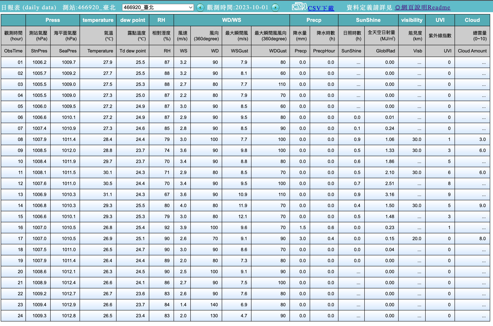

## 前言

在Project Amaterasu中，我們準備了台灣的高速公路車流資料。在這篇文章中，我們將下載氣象署的氣候資料，並在後續的開發中嘗試使用這些氣象資料作為特徵來預測車流。

## 前置準備

### 確保資料來源

首先，為了取得氣象資料，需要確保資料的來源。我們將使用氣象署所提供的「觀測資料查詢(CODiS)」[平台](https://e-service.cwb.gov.tw/HistoryDataQuery/)作為資料來源。並觀察如何從這個網站爬取我們所需要的資料。


### 觀察資料取得方式

要爬取CODiS平台之前，我們可以先觀察一下該平台是如何取得資料並在網頁端呈現。我們可以隨意選取一個測站來進行觀察。以台北市的台北測站為例，查詢2023年10月份的每小時觀測資料來觀察網站的行為：


在點選搜索之後，將會有一個新的視窗彈出，並提供我們對應的資料：



這個彈出的視窗對應的網址為：

```
https://e-service.cwb.gov.tw/HistoryDataQuery/DayDataController.do?command=viewMain&station=466920&stname=%25E8%2587%25BA%25E5%258C%2597&datepicker=2023-10-01&altitude=5.3m
```

可以注意到CODiS平台取的資料的方式是將所有參數置於網址，並使用**GET**的方法來向伺服器取得資料。而所需要的參數包括：

* command: 指令，此項不需要更改。
* station: 測站代號。
* stname: 測站名稱。
* datepicker: 日期，格式為YYYY-mm-dd。
* altitude: 測站高度。

比較需要注意的是，測站名稱是經過編碼的，會需要一些處理來符合對應的格式。另外就是高度的資料我們在目前尚未得知。我們將會在下一個章節示範如何取得所需的資訊。

### 取得測站資訊

在爬取資料的時候，我們需要測站以及測站的對應資訊。這些資訊可以從氣象署所提供的[測站資料](https://e-service.cwb.gov.tw/wdps/obs/state.htm)中取得。

在測站資料的網站中，我們可以取的**現存測站**以及**已撤銷測站**的所有資訊。


為了後續使用方便，我們可以使用`Pandas`模組來把現存測站的表格下載並用於後續的資料下載。詳細下載程式碼如下：

```python
import pandas as pd

base_url = 'https://e-service.cwb.gov.tw/wdps/obs/state.htm'

html_tables = pd.read_html(base_url)

# 有現存以及已撤銷兩個表格，在此僅取現存測站表格
existing_station = html_tables[0]

existing_df = (
    existing_df[~existing_df['站名'].isin(["五分山雷達站", "墾丁雷達站"])]
    .reset_index(drop=True)
)

existing_df.to_csv('existing_station.csv')
```

> 由於五分山雷達站以及墾丁雷達站僅有雷達資訊，在爬取時將無法正常取得資訊，所以我們將這兩個測站剔除了。

有了這張表的資訊之後，我們就可以撰寫一個Python程式來自動下載氣候資料了。

## 撰寫程式

### 站名轉換

首先，我們先來處理站名的轉換問題。以**台北**為例，在連結中呈現的是：

```
%25E8%2587%25BA%25E5%258C%2597
```
這個字串是經過了`URL Encoding`處理的結果，我們可以試著將**台北**兩個字利用`urllib`的`parse.quote`函式進行編碼，並觀察結果：

```python
from urllib import parse

string = '台北'

parse.quote(string)
```

結果會如以下所示：
```
'%E5%8F%B0%E5%8C%97'
```

可以發現跟連結中的稍微還是有些差異，這是因為`%`的編碼是`%25`的關係。為了處理這個問題，我們有兩種可行的做法：

1. 將`parse.quote`產生的`%`置換成`%25`。
2. 對`parse.quote`產生的結果再進行一次`parse.quote`來將`%`編碼為`%25`。

為求簡單，我們採用第一種做法，以下是一個編碼的範例：

```python
from urllib import parse

string = '台北'

encoded_stname = parse.quote(string)
encoded_stname = encoded_stname.replace('%', '%25')
print(encoded_stname)
```

經過以上處理，我們可以得到連結中的版本：

```
'%25E5%258F%25B0%25E5%258C%2597'
```

### 確認資料數量

在下載前，我們可以計算一下有多少的資料需要下載。首先，我們先來了解一下現存測站的數量：

```python
import pandas as pd 

df = pd.read_csv('existing_station.csv')

print(df.shape)
```

我們可以得知我們總用有**13**個欄位，並有**728**筆測站資料。
```
(728, 13)
```

在此之上，如果我們要下載所有測站在某一個月分的所有觀測資料，可以想見資料的數量將會非常龐大，需要在下載的同時就為資料夾建立一定的結構，方便後續處理以及整理。

### 建構下載程式

與上一篇[文章](https://dstipscafe.github.io/blogs/p/project_amaterasu_data_prepare/)相同，我們將會採用`ThreadPoolExecutor`來進行資料的下載。下載的步驟如下：

1. 產生要爬取的日期列表
2. 產生要下載的測站列表（包含必要參數）
3. 結合日期以及測站資訊
4. 建構下載函數
5. 建構基於`ThreadPoolExecutor`的執行物件
6. 進行下載

#### 建構日期列表

首先，我們可以使用`Pandas`的`date_range`來快速建立一個日期串列：

```
import pandas as pd 

date_list = (
    pd.date_range(
        '2023-10-01',
        '2023-10-31',
        freq='1D',
    )
    .to_series()
    .apply(lambda _dt: datetime.strftime(_dt, format='%Y-%m-%d'))
).values

print(date_list)
```

我們將得到一個帶有以下元素的串列：

```
['2023-10-01' '2023-10-02' '2023-10-03' '2023-10-04' '2023-10-05'
 '2023-10-06' '2023-10-07' '2023-10-08' '2023-10-09' '2023-10-10'
 ...
 '2023-10-26' '2023-10-27' '2023-10-28' '2023-10-29' '2023-10-30'
 '2023-10-31']
```

#### 建構測站資訊列表

接下來，我們可以建構一個帶有**測站代號**、測站名稱、以及海拔高度的陣列，用以作為連結的參數使用。假設我們已經讀取了先前所下載的`existing_station.csv`，我們可以只取三個欄位，並利用`.values`將資料表轉換為Numpy的陣列。

```python
df[['站號', '站名', '海拔高度(m)']].values
```

我們可以輕易得到以下結果：

```
array([['466881', '新北', 24.06],
       ['466900', '淡水', 19.0],
       ['466910', '鞍部', 837.6],
       ...,
       ['V2C260', '八德蔬果', 103.0],
       ['V2K610', '大庄合作社', 23.0],
       ['V2K620', '麥寮合作社', 9.0]], dtype=object)
```

#### 結合日期以及測站資訊

在先前的兩個部份中，我們分別準備好了日期以及測站相對應的資訊。在把這兩個資訊作為參數傳遞給下載的函數之前，需要做一個額外的準備，那就是——將兩個資訊所構成的列表進行對齊。如果直接把兩個列表用`zip()`一對一的做整合，將會出現以下的狀況。

```
2023-10-01 ['466881' '新北' 24.06]
2023-10-02 ['466900' '淡水' 19.0]
2023-10-03 ['466910' '鞍部' 837.6]
2023-10-04 ['466920' '臺北' 5.3]
2023-10-05 ['466930' '竹子湖' 607.1]
...
```

可以發現每個日期只會對應到測站一次，且可以預見當日期列表的長度大於測站列表的長度時，將會無從對應，進而造成參數的缺失。

我們有兩種方式可以解決，一種是用**兩層的for迴圈**來處理（當然，你可以用列表推倒式來建構這個雙層回圈），另一種則是使用`iterools`模組的`product`函式來處理。`product`函式的作用，簡單來說就是把兩個列表中的元素基於[笛卡兒積](https://zh.wikipedia.org/zh-hant/%E7%AC%9B%E5%8D%A1%E5%84%BF%E7%A7%AF)進行重新組合，構成新的列表。以下是一個範例：

```python
from itertools import product

a = [1,2,3]
b = [4,5,6]

result = list(product(a, b))

print(result)
```

經由`product`所產生的結果如以下所示：

```
[(1, 4), (1, 5), (1, 6), (2, 4), (2, 5), (2, 6), (3, 4), (3, 5), (3, 6)]
```

可以發現`a`與`b`之中的元素被一對一的組合，並構成了新的串列。這正是我們所需要的功能，我們需要把所有日期與所有的測站資訊一一對應，來確保每一個測站都能夠下載到所有目標日期的資料。接下來就是實作的部分了：

```python
date_list = (
    pd.date_range(
        '2023-10-01',
        '2023-10-31',
        freq='1D',
    )
    .to_series()
    .apply(lambda _dt: datetime.strftime(_dt, format='%Y-%m-%d'))
).values

station_list = df[['站號', '站名', '海拔高度(m)']].values
arguments = list(product(date_list, station_list))
```

經由以上處理，我們可以得到一個`arguments`串列，並包含了我們需要的參數：

```
[('2023-10-01', array(['466881', '新北', 24.06], dtype=object)),
 ('2023-10-01', array(['466900', '淡水', 19.0], dtype=object)),
 ('2023-10-01', array(['466910', '鞍部', 837.6], dtype=object)),
 ...
```

到此為止，我們已經準備好了要傳遞給下載程式的參數了。


#### 建構程式

接下來，我們可以開始建構下載資料的函式。這個函式將接收**日期**以及**測站資料**作為參數，並將參數做必要的處理後，組合成一個連結，並從連結下載對應的資料表，最後將資料表儲存到指定的資料夾。

為方便整理，且避免過於複雜的資料夾結構造成後續讀取資料時的麻煩，我們將會把下載的資料儲存在以**測站代號**命名的資料夾中。

```python
def getHistoryWeatory(args):
    date, (station_code, station_name, station_height) = args
    base_search_url = 'https://e-service.cwb.gov.tw/HistoryDataQuery/DayDataController.do'

    parsed_stname = parse.quote(station_name)
    parsed_stname = parsed_stname.replace("%", "%25")

    try:
        _url = f"{base_search_url}?command=viewMain&station={station_code}&stname={parsed_stname}&datepicker={date}&altitude={station_height}m"
        _df = pd.read_html(_url, encoding='utf-8')[-1]
        
        archive_dir_prefix = f"./data/history_weather/{station_code}"
        archive_filename = f"{station_name}_{station_code}_{date}.csv"
        os.makedirs(archive_dir_prefix, exist_ok=True)
        _df.to_csv(f"{archive_dir_prefix}/{archive_filename}")
    except ValueError:
        msg = (
            "Failed to find any table from provided URL:\n"
            f"{_url}\n"
            "Remark: \n"
            f"Date: {date}\n"
            f"Station ID: {station_code}\n"
        )
        print("-"*80)
        print(msg)
```

眼尖的你，可能會發現我們使用了`try...except`的語句來嘗試捕捉一些錯誤。在這個下載的程式中，我們可以預期資料庫中可能存在一些資料的缺失。這時候`try....except`可以協助我們捕捉是在抓取哪一份資料時出現了錯誤，並提供我們評估這個錯誤是否需要被處理。

> 另外，執行以上程式碼還會觸發`BeautifulSoup`的警告，警告內容為：「UserWarning: You provided Unicode markup but also provided a value for from_encoding.」。這個錯誤主要是在`pd.read_html`的[程式碼](https://github.com/pandas-dev/pandas/blob/2a953cf80b77e4348bf50ed724f8abc0d814d9dd/pandas/io/html.py#L666)所造成的，可以無視。

在準備好下載的函式後，我們就可以來建構基於`ThreadPoolExecutor`的執行物件，協助我們將參數傳遞給下載程式，並執行下載任務：

```python
with ThreadPoolExecutor(max_workers=12) as executor:
    result = executor.map(getHistoryWeatory, arguments)
```

接下來只要執行以上的程式碼，就會開始自動的下載對應的資料了。需要注意的是，由於資料數量非常的龐大，建議縮小目標測站的範圍，減少運行時間。另外，建議在下載程式中使用`time.sleep()`函式來限制下載的頻率，避免因為短時間內對資料庫發出過多請求，被對方給封鎖。

下載後，資料夾應該會有以下的結構：
```
data
└── history_weather
    ├── 466881
    │   └── 新北_466881_2023-10-01.csv
    ├── 466900
    │   └── 淡水_466900_2023-10-01.csv
    ├── 466910
    │   └── 鞍部_466910_2023-10-01.csv
...
```

## 完整程式碼

```python
import os
import pandas as pd

from urllib import parse
from concurrent.futures import ThreadPoolExecutor

def getHistoryWeatory(args):
    date, (station_code, station_name, station_height) = args
    base_search_url = 'https://e-service.cwb.gov.tw/HistoryDataQuery/DayDataController.do'

    parsed_stname = parse.quote(station_name)
    parsed_stname = parsed_stname.replace("%", "%25")

    try:
        _url = f"{base_search_url}?command=viewMain&station={station_code}&stname={parsed_stname}&datepicker={date}&altitude={station_height}m"
        _df = pd.read_html(_url, encoding='utf-8')[-1]
        
        archive_dir_prefix = f"./data/history_weather/{station_code}"
        archive_filename = f"{station_name}_{station_code}_{date}.csv"
        os.makedirs(archive_dir_prefix, exist_ok=True)
        _df.to_csv(f"{archive_dir_prefix}/{archive_filename}")
    except ValueError:
        msg = (
            "Failed to find any table from provided URL:\n"
            f"{_url}\n"
            "Remark: \n"
            f"Date: {date}\n"
            f"Station ID: {station_code}\n"
        )
        print("-"*80)
        print(msg)

def main():

    existing_df = pd.read_csv('existing_station.csv')

    date_list = (
        pd.date_range(
            '2023-10-01',
            '2023-10-31',
            freq='1D',
        )
        .to_series()
        .apply(lambda _dt: datetime.strftime(_dt, format='%Y-%m-%d'))
    ).values

    station_list = existing_df[['站號', '站名', '海拔高度(m)']].values
    arguments = list(product(date_list, station_list))

    with ThreadPoolExecutor(max_workers=12) as executor:
        result = executor.map(getHistoryWeatory, arguments)

if __name__ == '__main__':
    main()
```

## 小結

在本文中，我們介紹了如何從氣象署的CODiS平台爬取我們所需要的天氣資訊，接下來我們將開始整理所下載的車流資料以及氣候資料，作為後續的訓練資料使用。