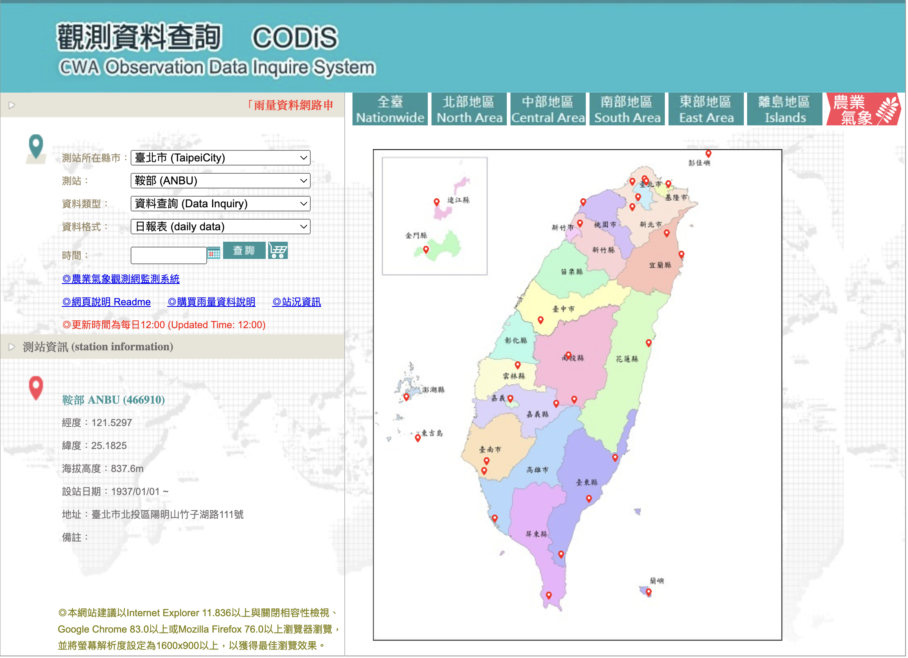
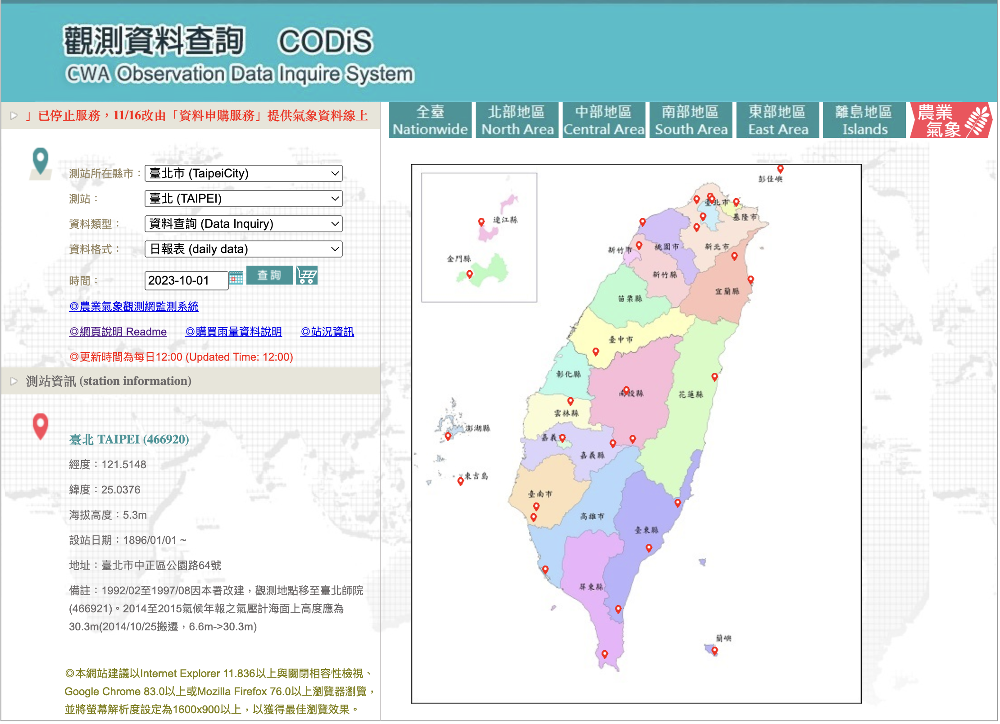
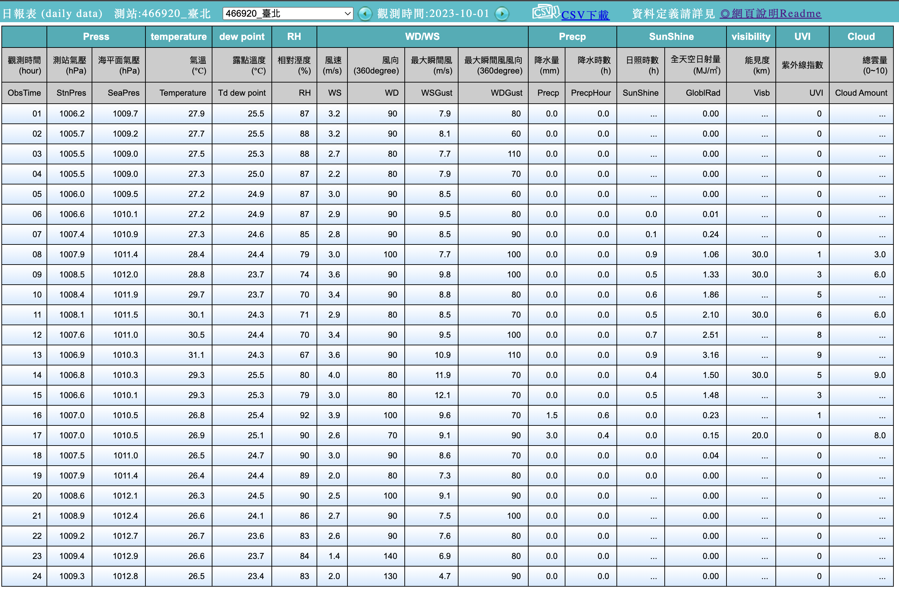

## Preface

Besides traffic counts, Project Amaterasu also uses weather data from Taiwan's Central Weather Administration to enhance predictions.

## Preparation

### Identify Data Source

The CODiS platform provides historical observations.  We explore how it retrieves and displays data in order to automate downloads.



Select a station (e.g., Taipei) and inspect network requests when querying hourly data.



A pop‑up window shows the results:



By examining the network panel we find a URL pattern that accepts parameters such as station ID and date.  With this information we can programmatically fetch CSV files.

## Implementation

Use Python with `requests` and `csv` to download and save the data:

```python
import requests

URL = "https://e-service.cwb.gov.tw/HistoryDataQuery/csv"
params = {"station": "C0A9C0", "start": "2023-10-01", "end": "2023-10-31"}
resp = requests.get(URL, params=params)
with open('taipei_oct.csv', 'wb') as f:
    f.write(resp.content)
```

Automate multiple requests by iterating over station IDs and dates.

## Summary

By reverse‑engineering CODiS network calls, we can systematically gather weather features for Project Amaterasu.
