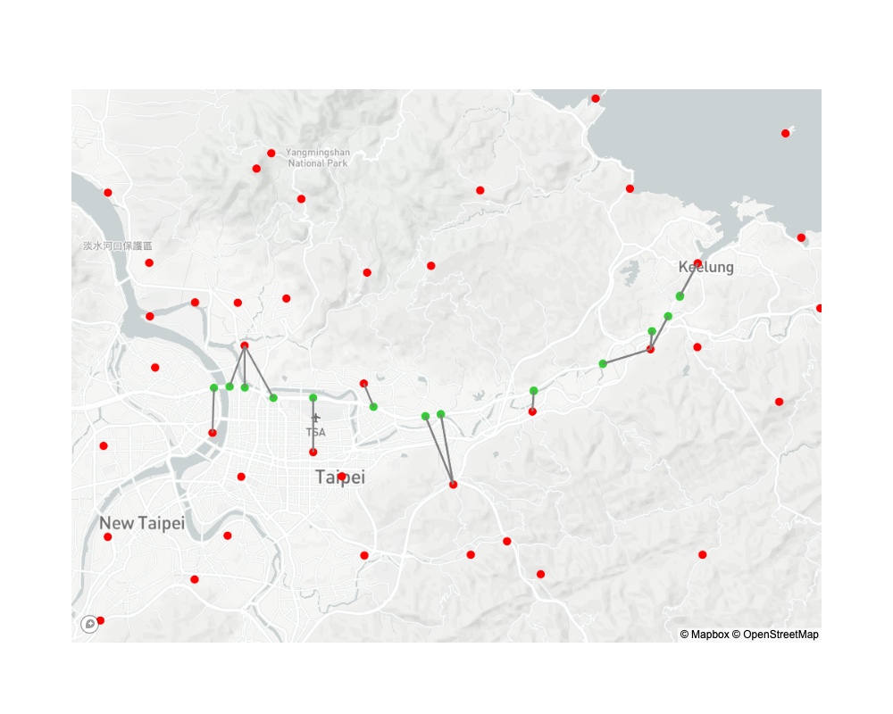

## 前言

在前幾篇的文章中，關於高速公路車流量、天氣資料以及對應的測站資料已經準備好了，接下來就是關於資料前處理的部分了。如果要將氣候資料與測站進行連結，使用經緯度資訊來進行配對是必要的步驟。在本文中，將介紹如和取得國道門架的經緯度資訊並使用簡易的畢氏定理來將國道門架與最近的氣候測站進行配對。

## 取得國道門架資訊

首先，國道門架的資訊可以到[政府開放資訊平台](https://data.gov.tw/)下載（[連結](https://data.gov.tw/dataset/21165)）。

## 計算並配對國道門架以及氣象測站

在先前的[文章](https://dstipscafe.github.io/blogs/p/project_amaterasu__weather_data_prepare/)中已經介紹過如何取得氣象測站的位置以及相關資訊。結合上一篇文章中的資料以及上一章節的國道門架資訊，將可以為每一個國道門架指定一個最接近的氣象測站，並以該測站的觀測資訊作為天氣特徵進行模型的訓練。

### 配對程式設計

在計算球體表面兩個點的距離時，需要考慮球體表面的弧度方可以做出精確的計算。不過由於台灣的國道門架以及氣象測站數量相當豐富，基本上可以忽略曲面所帶來的誤差，若不在意精確的距離，便可使用畢氏定理來簡化距離的計算，並找出最距離每個國道門架最近的氣象測站。以下是配對程式的設計概念：

* 讀取資料：由於取得的資料均為`csv`檔案，只需要使用`Pandas`即可輕易的讀取資料。
* 配對算法：可以使用將氣象測站以及門架的經緯度資訊轉換為`Numpy`，在計算出所有組合的距離之後，使用`numpy.argmin`找出最短距離的組合，並將配對代號進行記錄。

以下是程式碼的部分：

```python
import numpy as np
import pandas as pd

def find_nearest(gantry_info, stn_info):
    gantry_id, gantry_lon, gantry_lat = gantry_info
    
    diff_lon = stn_info[:, 1] - gantry_lon
    diff_lat = stn_info[:, 2] - gantry_lat

    dis_array = diff_lon**2 + diff_lat**2
    diff_dis = np.sqrt(dis_array.astype(float))
    
    min_dis_idx = np.argmin(diff_dis)
    
    return stn_info[min_dis_idx, 0]

existing_df = pd.read_csv('./existing_weather_station.csv')
gantry_df = pd.read_csv('../data/info/GantryID_loc_info.csv')

gantry_geo_info = gantry_df[['編號', '經度', '緯度' ]].values
stn_geo_info = existing_df[['站號', '經度', '緯度' ]].values

nearest_pair = [find_nearest(_gantry_info) for _gantry_info in gantry_geo_info]

gantry_df['鄰近測站代號'] = nearest_pair
```

在上方的程式碼中，一次有一筆門架的經緯度資訊被傳入`find_nearest`函式之中。在這個門架的經緯度資訊與**所有**氣象測站的經緯度資訊進行計算後，函式將會根據`numpy.argmin`所提供的資訊，找出對於這個門架來說最近的氣象測站的站號，並回傳。在找出所有門架的對應氣象測站後，我們在`gantry_df`的資料表中新增一個`鄰近測站代號`欄位，並將所得到的配對資訊記錄在這個欄位之中。

### 結果驗證

在配對完之後，可以使用`plotly`以及`mapbox`進行視覺化，並驗證先前的配對程式是否正確。首先，使用`Pandas`的`merge`功能將氣象測站的經緯度資訊新增到`gantry_df`之中。由於`plotly`在使用`mapbox`進行視覺化，並在兩個點中間畫出一條線，必須要將起點與終點的資訊以串列的方式傳遞給`plotly`，所以我們會額外建立兩個內容為串列的欄位，用以儲存精度與緯度的起／終點資訊。以下是驗證以及的程式碼。

> 使用`mapbox`的圖資時需要先註冊並取得token。

```python
import plotly.graph_objects as go

gantry_df = gantry_df.merge(
    existing_df, 
    left_on='鄰近測站代號', 
    right_on='站號'
)

gantry_df['經度連線'] = gantry_df[['經度_x', '經度_y']].values.tolist()
gantry_df['緯度連線'] = gantry_df[['緯度_x', '緯度_y']].values.tolist()

fig = go.Figure()

token = open(".mapbox_token").read() # you need your own token

fig.add_trace(
    go.Scattermapbox(
        lon=gantry_df['經度_x'],
        lat=gantry_df['緯度_x'],
        mode='markers',
        text='國道門架',
        marker={
            'size': 10,
            'color': 'limegreen',
        }
    )
)

fig.add_trace(
    go.Scattermapbox(
        lon=existing_df['經度'],
        lat=existing_df['緯度'],
        mode='markers',
        text='氣象測站',
        marker={
            'size': 10,
            'color': 'red',
        }
    )
)

for idx, row in gantry_df[['緯度連線', '經度連線']].iterrows():
    # print(row[0])
    fig.add_trace(
        go.Scattermapbox(
            lon=row[1],
            lat=row[0],
            mode='lines',
            text='門架－測站連線',
            marker={
                'color': 'grey',
            }
        )
    )


fig.update_layout(
    width=1000,
    height=800,
    hovermode='closest',
    showlegend=False,
    mapbox=dict(
        accesstoken=mapbox_access_token,
        zoom=6,
        style='light',
        center={'lon': 120.58, 'lat': 23.34},
    ),
)

fig.show()

```

為求輕便，以下的範例僅將部分的配對進行視覺化。圖中綠色的點是國道門架的位置，紅色的點是氣象測站的位置。可以發現程式已經按照預期的把國道門架與鄰近的氣象測站配對在一起。



## 儲存結果

在確認完成程式已依設計運行後，可以使用`Pandas`資料表所帶有的`to_csv`功能將`gantry_df`儲存為`csv`檔案，並提供後續使用。

## 結語

在本文中介紹了如何簡易的使用`Pandas`以及`Numpy`來進行國道門架的配對，並使用了`plotly`進行視覺化，驗證了程式的運行結果。後續的文章將會介紹如何把先前所下載的大量資料透過[Dask](https://www.dask.org/)所提供的強大資料處理能力進行快速的資料前處理以及整合。