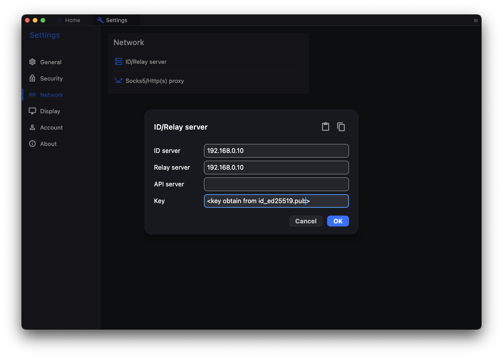
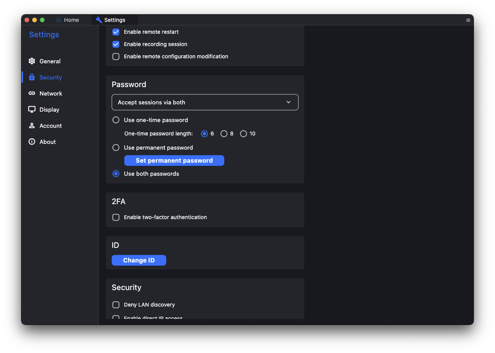

## 簡介

在遠端開發上，`Team Viewer`或是`VNC`等等軟體都是大家耳熟能詳的遠端桌面工具。現在，我想要為各位介紹一個新選擇：**RUST Desktop**。**RUST Desktop**是一個基於RUST所撰寫的遠端桌面程式，且支援地端自行架設服務。在這篇文章中，我會介紹如何透過地端自架的**RUST Desktop**伺服器服務，使得Macbook Pro可以連線至工作站的Ubuntu虛擬機。


## 前置準備

1. 遠端的Ubuntu虛擬機需要安裝`Gnome`或其他桌面軟體
2. 需要在Ubuntu虛擬機以及Macbook Pro安裝Rust Desktop客戶端（下載連結：https://github.com/rustdesk/rustdesk/releases/tag/1.3.6）

## 安裝Rust Desktop Server

### 取得並安裝軟體

首先，請到官方的[GitHub](https://github.com/rustdesk/rustdesk-server/releases/tag/1.1.12)下載對應的檔案，以Ubuntu為例，應下載以下檔案：

```
rustdesk-server-hbbs_1.1.12_amd64.deb
```

在下載完成後，可以使用以下指定進行安裝：

```shell
sudo apt install <your .deb filename>
```

### 啟動Rust Desktop 伺服器服務

在自架Rust Desktop的伺服器服務時，需要啟動兩個服務，分別為`hbbs`以及`hbbr`，這兩個服務分別負責ID以及Relay的處理，這邊我們就不深入介紹。在官方的文件中有兩種啟動方式：**直接執行**以及透過**PM2**軟體啟動。

* 直接啟動

作為測試使用，我們可以直接啟動`hbbr`以及`hbbs`服務進行測試。實務上可以使用`tmux`來確保啟動後能夠持續運作。

首先，先使用`tmux`指令啟動一個CLI環境，並使用`./hbbs`服務

```shell
tmux
./hbbs
```

接下來，可以使用`ctrl+b`並輸入`d`來脫離`tmux`建立的CLI環境。然後我們可以在建立另一個環境，啟動`hbbr`服務：

```shell
tmux
./hbbr
```

* 透過`PM2`啟動

`PM2`是一個背景任務管理器，我們可以透過`npm`進行安裝：

```shell
npm install pm2 -g
```

在安裝完成後，我們可以使用`pm2 start`指令來啟動`hbbr`以及`hbbs`服務。

```shell
pm2 start hbbs
pm2 start hbbr
```

當要關閉時，可以使用`pm2 stop <service name>`來關閉指定的服務。

Rust Dektop 伺服器將會佔用以下幾個連接埠：

* TCP (21114, 21115, 21116, 21117, 21118, 21119)
* UDP (21116)

### 取得金鑰

當`hbbs`以及`hbbr`服務啟動後，將產生兩個檔案，分別為`id_ed25519`以及`id_ed25519.pub`。我們需要`id_ed25519.pub`其中的金曜作為後續使用。

## 設定客戶端

### Rust Desktop客戶端設定

將下來，我們需要設定客戶端。假設我們的Rust Desktop 伺服器所在主機的`IP`位置為`192.168.0.10`，請在Ubuntu虛擬機以及Macbook Pro的客戶端設定中輸入以下資訊：



### 設定密碼

為了方便後續使用，我們可以為連線設定一個固定的密碼。詳細的設定可以在**Setting > Security > Pasword**設定中，選擇**Use permanent password**並設定固定密碼即可。




## 建立連線

恭喜，完成了先前設定之後，只要在Macbook Pro的客戶端輸入Ubuntu虛擬機客戶端所提供的`ID`即可建立連線囉！

## 小結

這篇文章算是給自己的筆記，也分享給大家如何在地端自己架設Rust Desktop的伺服器，並提供內網的遠端桌面服務。希望能幫助到有需要使用遠端桌面，又不希望使用Team Viewer或是其他工具的讀者～


---

如果覺得我的文章對你有幫助，歡迎請我喝一杯咖啡～


<a href="https://www.buymeacoffee.com/ds_cafe_and_tips"></a>