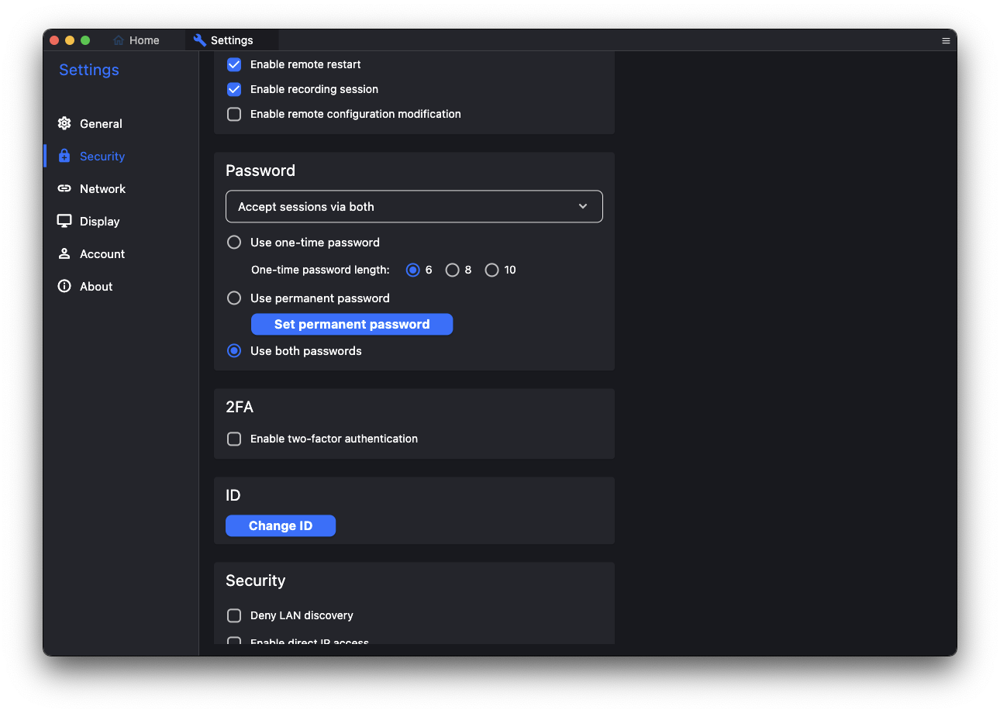

## Introduction

TeamViewer, VNC and similar tools are well known for remote desktop usage. Here I would like to introduce **RustDesk**, a remote desktop program written in Rust that can be self-hosted. In this article we will host a RustDesk server locally so a MacBook Pro can connect to an Ubuntu VM.

## Prerequisites

1. The remote Ubuntu VM needs a desktop environment such as Gnome
2. Install RustDesk clients on both the Ubuntu VM and the MacBook Pro ([download link](https://github.com/rustdesk/rustdesk/releases/tag/1.3.6))

## Install RustDesk Server

### Download and install

Go to the [official GitHub repository](https://github.com/rustdesk/rustdesk-server/releases/tag/1.1.12) and download the appropriate file. For Ubuntu download:

```text
rustdesk-server-hbbs_1.1.12_amd64.deb
```

After downloading install it with:

```shell
sudo apt install <your .deb filename>
```

### Start the RustDesk server services

Two services need to run for a self-hosted RustDesk server: `hbbs` and `hbbr`. They handle ID and relay respectively. The documentation shows two ways to start them: directly or via **PM2**.

* Direct execution

  For testing we can start `hbbs` and `hbbr` directly. Using `tmux` keeps them running.

  ```shell
  tmux
  ./hbbs
  ```

  Detach with `ctrl+b` then `d`, create another session and run `hbbr`:

  ```shell
  tmux
  ./hbbr
  ```

* Use `PM2`

  `PM2` is a process manager that can run the services in the background. Install it with:

  ```shell
  npm install pm2 -g
  ```

  Start the services:

  ```shell
  pm2 start hbbs
  pm2 start hbbr
  ```

  Stop services with `pm2 stop <service name>`.

The RustDesk server uses the following ports:

* TCP (21114, 21115, 21116, 21117, 21118, 21119)
* UDP (21116)

### Obtain keys

After `hbbs` and `hbbr` start they generate `id_ed25519` and `id_ed25519.pub`. The public key in `id_ed25519.pub` will be used later.

## Client configuration

### RustDesk client settings

Assuming the server runs at `192.168.0.10`, open the network settings on both the Ubuntu VM and the MacBook Pro clients and fill in the values as shown below.


### Set a password

To simplify usage, set a permanent password in **Setting > Security > Password** and enable **Use permanent password**.



## Establish connection

After completing the configuration, simply enter the ID provided by the Ubuntu VM client in the MacBook Pro client to connect.

## Conclusion

This article serves as my own notes and a guide for self-hosting a RustDesk server to provide an internal remote desktop service. I hope it helps readers who need remote desktop access but prefer not to use TeamViewer or other tools.

---

If you find this article helpful, feel free to buy me a coffee.

<a href="https://www.buymeacoffee.com/ds_cafe_and_tips"></a>
