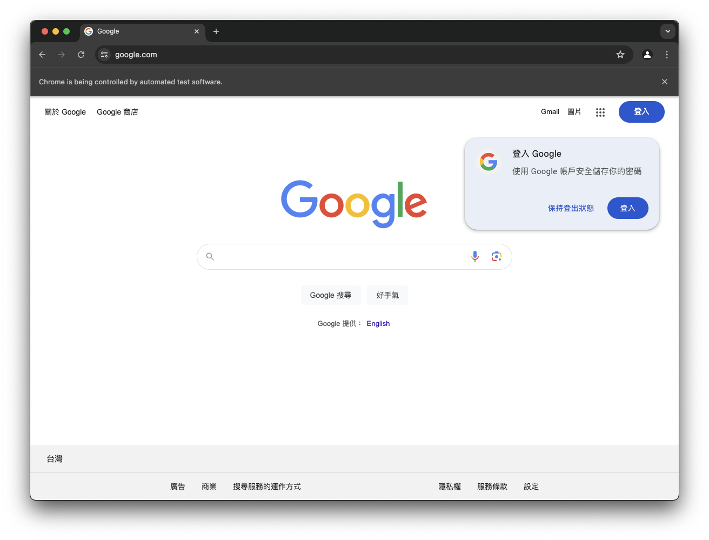
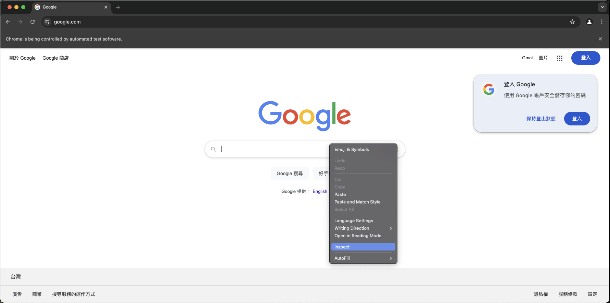
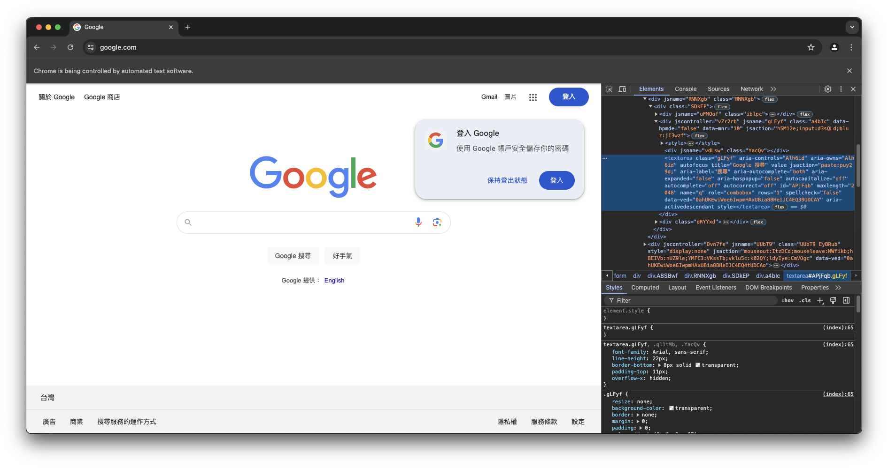
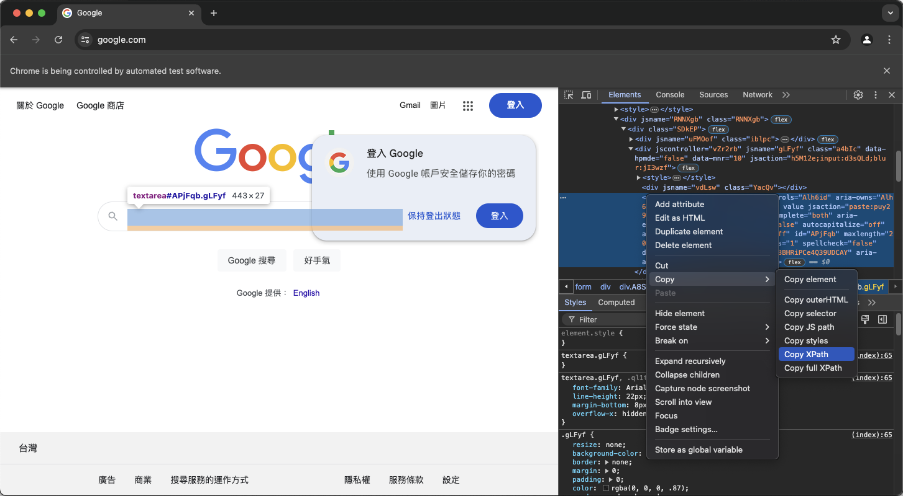
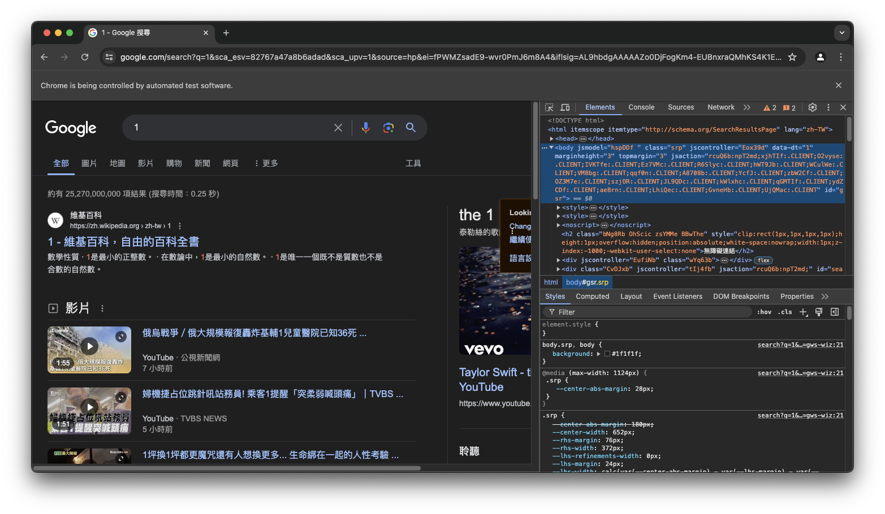

## 前言

不知道你有沒有遇過這種經驗：「我好想要做一個專案，可是我沒有辦法取得我想要的資料」？ 作為一般人，我們在資料集的取得上，多數會以政府公開資料集、Kaggle資料集、或是一些善心的貢獻者公開在各種地方提供大家下載的資料。這些資料或許已經經過整理，但不一定符合專案的需求。這時候網路爬蟲就是一個很關鍵的技術了。廣義的網路爬蟲可以是透過直接向API索取資料，也可以是使用一些工具來將人類的操作進行自動化，進而達成資料搜集的目的。在這個系列的文章中，我們將會為各位介紹[Selenium](https://www.selenium.dev/)這個互動式爬蟲的工具，並實際爬取中央氣象局的資料來進行示範。

## 前置準備

### Selenium 介紹

[Selenium](https://www.selenium.dev/)是一個能夠將網頁瀏覽進行自動化的工具，用途包含但不限於網站測試，爬蟲以及其他需要對網頁進行自動化的操作。在這篇文章中，我們將使用Python來進行相關程式的撰寫。

### Selenium 安裝

我們可以使用`pip`來進行安裝：

```python
pip install selenium
```

### Webdriver 安裝

在使用Selenium時，需要下載與瀏覽器對應的web driver。一般情況下，我們可以使用`webdriver_manager`來進行安裝。首先，我們使用`pip`安裝`webdriver_manager`：

```
pip install webdriver-manager
```

然後執行以下的程式碼來進行web driver的安裝：

```python
from webdriver_manager.chrome import ChromeDriverManager

try:
    webdriver_path = ChromeDriverManager().install()
except Exception as e:
    raise e

```

如果沒有發生錯誤，就代表安裝成功了。倘若這個方法行不通，則需要前往瀏覽器提供商的網站進行下載，以Chrome為例，需要到這個[網站](https://developer.chrome.com/docs/chromedriver/downloads)進行下載。


下載web driver時，需要配合瀏覽器的版本進行下載！


## 開始使用

當前置準備都完成後，我們就可以開始使用Selenium了。接下來我們將介紹以及示範重要的操作需要如何完成。

### 基本操作示範

#### 啟動並連線至指定網站

在使用Selenium上，可以想像是把人類在瀏覽器的操作，以程式碼的方式進行撰寫，並交由電腦來進行運作。以開啟Google首頁來說，使用Selenium的步驟會是：

1. 建立driver物件，啟動瀏覽器。
2. 使用`driver.get()`方法搭配Google首頁網址[www.google.com](www.google.com)來連線至Google首頁。
   
程式碼如下：

```python
import time
from selenium import webdriver
from selenium.webdriver.chrome.options import Options

chrome_options = Options()
driver = webdriver.Chrome(options=chrome_options)
driver.get("https://www.google.com/")

# 避免執行結束自動關閉
time.sleep(10)
```

執行上方的程式碼之後，就可以看到程式啟動了一個視窗，並且連線至Google首頁。



#### 選取物件以及物件操作

當我們想要搜尋某些東西時，會在Google的搜索欄位輸入內容，而這又該如何透過Selenium來進行呢？ 我們需要以下的步驟：

1. 找到輸入欄位。
2. 輸入內容。
3. 點擊搜尋按鈕。

首先，我們可以透過在搜尋欄位的上方點擊右鍵，並點擊**inspect**來找到該物件在網頁構成中的部分。





可以發現，經由點擊**inspect**按鈕，網頁指出了這一個搜尋欄位是一個**textarea**的物件。接下來，我們需要取得這個物件，並對這個物件進行操作。步驟如下：

1. 使用`driver.find_element()`搭配對應的方法來進行物件的選取。
2. 使用`send_keys()`來將想輸入的內容輸入至物件。

在此，為求簡便，我們將直接使用**XPATH**作為選取的參考對象。



在得到這個XPATH以後，我們就可以找到欄位，並且輸入內容了。我們也可以用同樣的方法來找到搜尋按鈕，並按下按鈕來進行搜尋。但要注意的是，點擊按鈕使用的不是`send_keys`而是`click`方法。以下是程式碼：

```python
import time
from selenium import webdriver
from selenium.webdriver.common.by import By
from selenium.webdriver.chrome.options import Options

chrome_options = Options()
driver = webdriver.Chrome(options=chrome_options)
driver.get("https://www.google.com/")

# 找到搜尋欄位並輸入內容
search_area = driver.find_element(By.XPATH, '//*[@id="APjFqb"]')
search_area.send_keys('1')

# 找到按鈕並點擊
btn = driver.find_element(By.XPATH,  "/html/body/div[1]/div[3]/form/div[1]/div[1]/div[4]/center/input[1]")
btn.click()

# 避免執行結束自動關閉
time.sleep(10)
```



以上就是一個簡單的範例，示範了如何使用Selenium將搜尋流程進行自動化。

## 概念介紹

在上一個範例中，我們示範了如何選取物件，並與物件進行互動，進而達成搜尋的結果。接下來我們將介紹在Selenium可以如何進行物件的搜尋，以及與物件的互動。

### 物件搜尋

物件搜尋基本上是透過`driver.find_element()`以及`driver.find_elements()`來進行物件的搜尋。兩者只差在搜尋一個物件還是搜尋所有符合條件的物件。

在搜尋時，需要提供指定的**參考對象**以及對應的**標籤**來進行搜尋。目前在Python可以使用的有以下幾種參考對象：

* **XPATH**
* **class name**
* **css selector**
* **id**
* **name**
* **link text**
* **tag name**
* e.t.c

在此我們不詳細對於這幾種參考對象進行介紹，可以參考[Selenium官方文件](https://www.selenium.dev/documentation/webdriver/elements/locators/)或是了解HTML/CSS的詳細概念來了解。簡單來說，這些參考對象就只是一個讓Selenium在找尋你想要找尋的目標時，知道你想以哪一種手段來進行搜尋所需要用到的資訊。

在找到物件後，`find_element()`會回傳一個物件，我們可以透過這個物件進行`click()`或是`send_keys()`的操作來與物件互動。

### 物件互動

我們示範了使用`click()`以及`send_keys()`來與物件進行互動的方式，其實還有除此之外的許多方法。例如`click()`也可以使用`send_keys(Keys.ENTER)`來完成。此類操作在Selenium中被分類為**Action API**，而在[官方文件](https://www.selenium.dev/documentation/webdriver/actions_api/)中也有對應的介紹。

在本章節中，我想特別介紹的是`ActionChains()`這個功能。`ActionChains()`提供了類似Pandas的**Method Chaining**功能，讓使用者可以將數個動作串連在一起。以下是使用`ActionChains()`改寫先前的範例。

```python
import time
from selenium import webdriver
from selenium.webdriver.chrome.options import Options
from selenium.webdriver.common.by import By
from selenium.webdriver import Keys, ActionChains


chrome_options = Options()
driver = webdriver.Chrome(options=chrome_options)
driver.get("https://www.google.com/")

# 找到搜尋欄位
search_area = driver.find_element(By.XPATH, '//*[@id="APjFqb"]')

# 找到搜尋按鈕
btn = driver.find_element(By.XPATH,  "/html/body/div[1]/div[3]/form/div[1]/div[1]/div[4]/center/input[1]")

(ActionChains(driver)
    .move_to_element(search_area)
    .send_keys('1')
    .move_to_element(btn)
    .send_keys(Keys.ENTER)
    .perform()
)

time.sleep(10)

```

對於想了解更多操作上的範例的人，可以參考[官方文件](https://www.selenium.dev/documentation/webdriver/actions_api/)。

### 等待策略

在操作網頁時，並不是所有操作之後，就一定會有對應的物件出現。這時候我們就需要進行「等待」的操作。在Selenium中，主要有兩種等待方式：

1. 隱式等待
2. 顯式等待

前者基本上就是給定一個時間點，並進行等待；而後者則是可以在指定條件下進行等待，使得整體操作上有更多的彈性。舉例來說，顯式等待可以等到具體的元素出現，或是其物件特性滿足一定條件時，才完成「等待」的動作。詳細可以參考[官方文件](https://www.selenium.dev/documentation/webdriver/waits/)。我們將在下一篇文章中進行示範。

## 結語

在本篇文章中，我們大致介紹了使用Selenium進行互動式爬蟲時，會用到的幾種操作。在下一篇文章中，我們示範如何使用Selenium爬取台灣中央氣象署的氣候資料。