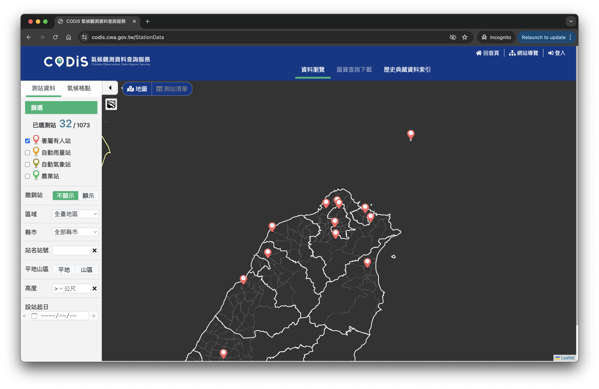
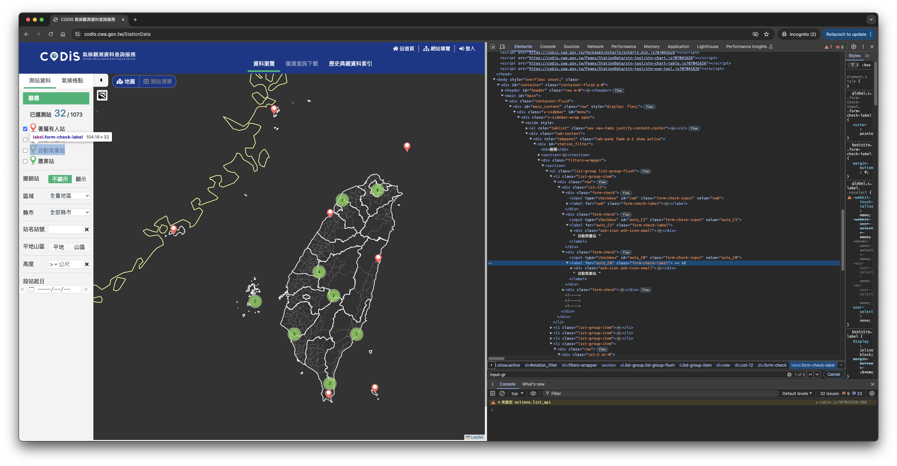

## 前言

在上一篇[文章](https://dstipscafe.github.io/blogs/p/selenium_basic/)中，我們介紹了Selenium的基礎概念以及操作示範。在這篇文章中，我們將以台灣中央氣象署為目標，實際使用Selenium來爬取特定測站的當日氣象觀測數據。

## 中央氣象署氣候觀測資料查詢服務

[氣候觀測資料查詢服務（CODiS）](https://codis.cwa.gov.tw/StationData)是台灣中央氣象署所提供的便民查詢服務。民眾可以藉由此服務查詢特定測站在特定日期的天候觀測資料。資料包含雨量、氣溫、濕度風速等等觀測資料。在時間尺度上，提供所有項目的每日、每月、每年以及單項資料的逐日、逐月、逐年資料。

在舊版網站中，我們可以直接透過使用**測站代號**、**測站海拔**以及其他必要資訊，以**GET**請求加上參數的形式直接獲取資料。但在新版的網站中，整個網站架構進行了相當大的改版，且引入了**session**的機制讓以往的資料爬取方式無法再使用。雖然仍可以使用戳API的方式獲取資料，但必須改用**POST**，且需要一些額外的步驟才能取得資料，同時，資料也不像網頁所提供的，是已經整理過的版本，而是以JSON形式交付的原始資料（Raw Data）。由於資料形式不同，在整理上需要花費額外的時間。

倘若想要獲取如同以往形式的資料，則需要透過Selenium來進行互動式爬蟲才能達成。我們將一步一步示範如何使用Selenium來達成這項工作。

## 流程建立

### 前置觀察

#### 基本測站標記觀察

使用Selenium進行爬蟲，基本上就是把人為的操作以電腦的手段進行實現，為此，我們需要先了解目標網站在查詢目標資料時，需要哪些步驟。首先，我們可以先看一眼未經任何操作的網站狀態：


可以發現到畫面主要分成左右兩側，左邊是篩選面板，右邊是地圖形式的顯示面板，讓使用者可以透過點擊地圖上的標記來展開測站資料。預設可以直接點擊的測站（紅色標記）僅有四個，其他的測站以區域為分類，使用了帶有數字的標記來簡化顯示的標記數量。在點擊北部的標記後，可以發現網站進行了縮放，並顯示出被分類在北部的測站標記。



我們也會注意到，在左側具有兩個與區域有關的篩選功能，分別為「區域」、「山地」以及「縣市」。以縣市作為範例，先篩選縣市可以讓地圖中指定縣市的標記出現。


觀察小結：當需要篩選特定區域測站時，可以使用左側篩選欄位的「區域」、「山地」或是「縣市」進行篩選，也可以透過點擊地圖上的分類標記來進行篩選。

#### 測站名稱代號篩選觀察

我們也可以在左方篩選欄位注意到，有一個「站名站號」的篩選功能，以台ㄍ北測站（測站代號：466920）為例，直接輸入此測站代號可以直接讓地圖上指定的標記出現。


#### 測站分類觀察

在預設中，網站僅顯示了**署屬有人站**的標記，當需要選取其他標記的時候，則需要將指定類別打勾，方能出現對應的標記。


#### 測站標記行為觀察（以台北測站為例）

我們接下來進行標記的行為觀察。以台北測站為例，在點擊標記後會出現對應的資訊匡：


點擊「觀看時序圖報表」後，可以展開細部資訊欄位：


在細部資訊頁面中，我們可以透過點擊日期來觸發日期選擇的功能：


也可以透過點擊年份以及月份來觸發年份以及月份選單：


並在點擊指定日期後，查詢特定日期的測資：


並可以透過點擊「CSV下載」按鈕來進行資料下載：


到這個階段，我們已經大致可以規劃出整體的程式碼需要如何實踐了。

#### 日期選單觀察

當有需要選取特定日期時，日期選單的細節就變得非常重要。接下來我們將觀察並建立操作日期選單的基礎。首先，我們一樣可以透過**inspect**來觀察日期選單在網頁中的組成。


可以注意到日期選單本身是一個帶有**class**為**vdatetime**的物件，這代表我們可以透過選擇策略搭配**CLASS＿NAME**來找到日期選單。


接下來，我們可以藉由展開**vdatetime**物件，來觀察內部的組成。在選擇年份及月份的部分，為一個帶有**class**為**vdatetime-popup__year**的**div物件**，同時，選擇月份的部分則是**class**為**vdatetime-popup__month**的**div物件**。


在日期部分，則是與年份以及月份的命名規則不同，為一個帶有**class**為**vdatetime-popup__body**的**div物件**。

##### 年份選擇

在進一步點擊年份之後，可以發現表單變成了選擇年份的模式，接下來我們可以觀察網站物件的變化。


可以發現**vdatetime-popup__body**的**div物件**從日期變成了年份的選單，且網站的程式碼自動生成了一組**class**雷同的年份物件，並透過細部的差異（即`disable`部分）來控制可以選擇的年份。

##### 月份選擇

接下來，我們同樣點擊月份選單的部分，可以發現其運作模式與年份選單相同。


##### 日期選擇

最後，我們回到最初始的狀態來行日期的選擇。


可以注意到**body**中有一個**calendar**物件，在其中分別有**navigation**、**month**以及**day**。前者可以切換月份，中間是顯示週一至週日的標籤，後者則是我們所需要的日期選擇部分。可以注意到整體模式與年份以及月份的選單是相同的邏輯。

###### 日期選單觀察小結

網頁中的日期選單是採用了Javascript進行動產生的，其規則簡單，可是因為其**class**沒有根據物件進行客製化，在選擇上需要一些技巧。


## 在開始之前

在開始之前，想介紹以及說明一些在進行互動式爬蟲時需要注意的部分。

### 注意進行操作後可能需要一段時間才會出現對應的物件

在現代的網站設計中，在點擊後以Javascript產生對應物件的行為是非常普遍的，而這個「產生」的動作是會需要花費時間的。在此之上，如何合理的運用上一篇文章中所提及的「等待策略」就是非常重要的。

### 注意自動產生的物件

在上一點中，我們提及了自動產生物件的狀況是非常常見的。在此之後，每一個物件的對應標籤（例如：CSS Selector或是tag等等）可能就不具有一定的順序性或是命名的可循性，甚至可能多個物件帶有相同的名稱（如同日期選單的觀察，在本網站中，日期選單的大部分物件都有類似狀況。）這時候如何靈活的運用上一篇文章中的「選擇策略」就顯得非常重要。

### 選擇策略的靈活性

在上一篇文章中，我們示範了使用了`driver.find_element()`來找到特定物件的作法。其實在這個做法之上，也可以使用`driver.find_element()`所回傳的物件（假設為`object`）本身帶有的`object.find_element()`方法，來限縮搜尋的範圍。在後面的範例中我們相會大量使用到這個技巧。

### 善用XPATH的功能

在XPATH的使用上，不單只是直接的指出某一個物件的位置而已。雖然透過**複製完整的XPATH**也可以達成效果，但這種方法在網頁有所改動時，容易出現錯誤。這時候，我們可以使用XPATH所提供的配對功能來進行模糊搜尋，以提升整體程式碼的易讀性以及維護性。以下是一個簡單的例子：

```
"//div[@class='row' and .//*[contains(text(), '縣市')]]"
```

以上這個表達式，可以找出符合以下條件的`<div>`物件：

1. `class`為**row**
2. 其內部元素的物件帶有文字，且文字內容包含**縣市**


這個技巧會在後續的範例中出現。



關於這部分的詳細介紹，可以參考以下兩個網站：
1. [Everything You Need to Know About the XPath Contains() Function](https://www.roborabbit.com/blog/everything-you-need-to-know-about-the-xpath-contains-function/)
2. [XPath Syntax by W3School](https://www.w3schools.com/xml/xpath_syntax.asp)



## 流程規劃

### 找到指定測站

根據先前的前置準備，我們可以建構以下流程(給定一個測站代號)：

1. 檢查是否為「署屬有人站」
   1. 是，不需額外動作
   2. 否，需要進行對應測站類別勾選
2. 找到「站名站號」的物件，並輸入給定的測站代號
3. 等待網站運作直到測站標記出現
4. 點擊測站標記並等待網站運作
5. 點擊「觀看時序圖報表」按鈕，並等待網站運作
6. 確認是否有指定日期
   1. 若否，則直接下載當日資料
   2. 若有，則進行日期選定
      1. 選擇年份，並等待網站運作
      2. 選擇月份，並等待網站運作
      3. 選擇日期，並等待網站運作
      4. 點擊下載
7. 完成

以上就是初步的流程規劃。接下來我們將進行實作示範。

## 實作示範

接下來我們將進行實作示範，我們將會分成三個部分來進行。

### 啟動網站搜尋測站

關於啟動網站的部分，與上一篇文章相同，我們將先對瀏覽器進行設定，並連線至CODiS平台。

```python
# 導入必要模組
import time
from selenium import webdriver
from selenium.webdriver.chrome.options import Options

# 設定瀏覽器參數
chrome_options = Options()

# 建立driver物件
driver = webdriver.Chrome(options=chrome_options)

# 連線至CODiS平台
driver.get("https://codis.cwa.gov.tw/StationData")

# 等待網站載入
driver.implicitly_wait(2)
```

接下來，我們需要將指定的測站進行檢查，確認是否為署屬有人站，並依照結果進行對應的處理。我們可以參考CODiS頁面中的「測站清單」來了解各個類別的代號命名原則。


透過以上四張截圖，我們可以簡單歸納出測站代號的規則：

1. 開頭為**46**的為署屬有人站
2. 開頭為**C1**的為自動雨量站
3. 開頭為**C0**的為自動氣象站
4. 不符合以上規則的為農業站

有了以上的規則，我們就能撰寫對應的程式碼了。以下是一個簡單利用**match-case**語法建構的條件控制，之後我們會將**return**改為對應物件的XPATH。

```python
def stn_type(stn_code: str):
    match stn_code[:2]:
        case '46':
            return 1
        case 'C1':
            return 2
        case 'C0':
            return 3
        case _:
            return 4
```

以先前的觀察，網站在預設的場景下會自動勾選「署屬有人站」，故在屬於其他的類別時，我們需要手動進行勾選。



可以注意到我們的目標對象會是一個在`div`物件底下的`input`物件，我們可以透過`id`來區分各個類別。我們可以藉此改寫上方的函式：

```python
def stn_type(stn_code: str):
    match stn_code[:2]:
        case '46':
            return None
        case 'C1':
            return "//div[@class='form-check' and .//input[@id='auto_C1']]"
        case 'C0':
            return "//div[@class='form-check' and .//input[@value='auto_C0']]"
        case _:
            return "//div[@class='form-check' and .//input[@value='agr']]"
```

由於署屬有人站是預設勾選的，所以在輸入的測站代號為該類別時，不需要做額外的處理，因此我們可以使用`if`在其他類別被選取到時，進行勾選：

```python
# ...(先前部分)

from selenium.webdriver.common.by import By

stn_code = "..."
stn_type_opt = stn_type(stn_code)

if stn_type_opt is not None:
    stn_input_element = driver.find_element(By.XPATH, stn_type_opt)
    stn_input_element.click()

```

有了可以根據輸入測站類別勾選測站類型的程式碼後，我們可以進入到測站的搜尋以及點擊環節。在先前的觀察中，我們可以注意到直接輸入測站代號並搜尋到對應的測站。要找到輸入欄位並進行輸入，則需要先找到對應的XPATH。


我們可以注意到，輸入測站代號的欄位是一個`input`物件，與**站名站號**的文字位於同一個`div`之中。這邊我們將採取先找到最上層的`div`，再找到其中的`input`物件的搜尋策略，所以我們將使用以下的程式碼來完成：

```python
# ...(先前部分)

# 找到輸入測站代號之上層div欄位
stn_code_row = driver.find_element(By.XPATH,  "//div[@class='row' and .//*[contains(text(), '站名站號')]]")

# 找尋input物件並將測站代號輸入
stn_input_element = stn_code_row.find_element(By.XPATH, ".//input[@class='form-control']")
stn_input_element.send_keys(stn_code)

# 等待網站運作
time.sleep(2)
```


可以注意到當程式碼執行到上方的部分後，畫面將會出現指定的測站標記。此時，我們要做的就是讓程式去點擊該標記，並展開標示：


我們可以注意到，構成標記的整個物件是一個`div`物件。在此，我們取`div`的**class**作為參考標記來進行標記的選取。

```python
# ...(先前部分)

# 找尋並點擊測站標記
map_icon = driver.find_element(
    By.XPATH, "//div[contains(@class, 'leaflet-interactive')]"
)
map_icon.click()

# 等待網站運作
time.sleep(2)
```


可以發現我們的程式碼正確的點擊了標記。

那麼，接下來就是繼續點擊「觀看時序圖報表」的按鈕了。我們同樣透過**inspect**來查看物件的細節：


可以注意到這個按鈕是`button`物件，並帶有與測站代號相同的`data-stn_id`屬性。那麼，示範到這裡，相信讀者們也很熟悉該如何處理了。以下是我們點擊按鈕的程式碼：

```python
# ...(先前部分)

# 找尋並點擊「觀看時序圖報表」按鈕
open_button = driver.find_element(
    By.XPATH, 
    f"//button[contains(@class, 'show_stn_tool') and contains(@data-stn_id, '{stn_code}')]"
)
open_button.click()

# 等待瀏覽器運作
time.sleep(2)
```

在執行上方的程式碼之後，將會透過點擊按鈕展開資訊報表。


至此，我們的第一階段，也就是準備動作已經完成。

### 調整日期

在成功展開資訊報表之後，下一個步驟就是將報表的日期挑整成我們期待的日期（這邊先假設以日報表為爬取目標，不處理其他時間尺度的報表）。在先前的章節中，我們曾經簡單的介紹過日期選單的組成，在此我們將稍微採取就以往不同的手段來進行處理。在先前的章節中，我們都是以主要的`driver`物件來進行物件的搜尋；在此章節，因為我們需要使用的物件都集中在一個大的物件底下，所以我們將把操作的對象從原本的`driver`轉換到這個區域的物件底下，縮減搜索範圍的同時，提高處理的效率，並避免找到錯誤的對象。


假設我們希望爬取「2020年1月1日」的天氣單日氣象觀測資料。

```python
# ...(先前部分)
from selenium.webdriver.common.action_chains import ActionChains

year = 2020
month = 'January'
day = 1

# 找到主要物件
main_panel = driver.find_element(
    By.XPATH, 
    "//div[contains(@class, 'lightbox-tool-type-container') and not(contains(@style, 'display: none;'))]"
)

# 找到日期選單
datetime_panel = main_panel.find_element(
    By.CLASS_NAME,
    "vdatetime"
)

# 點擊日期選單
actions = ActionChains(driver)
actions.move_to_element(datetime_panel).click().perform()

# 等待瀏覽器運作
time.sleep(2)

# 找到年份選單，點擊展開，並選擇指定年份
year_selector = main_panel.find_element(
    By.XPATH,
    "//div[contains(@class, 'vdatetime-popup__year')]",
)
year_selector.click()

year_opt = main_panel.find_element(
    By.XPATH,
    f"//div[contains(@class, 'vdatetime-year-picker__item') and contains(text(), '{year}')]",
)
year_opt.click()

# 找到月份選單，點擊展開，並選擇指定月份
month_selector = main_panel.find_element(
    By.XPATH,
    "//div[contains(@class, 'vdatetime-popup__date')]",
)
month_selector.click()

month_opt = main_panel.find_element(
    By.XPATH,
    f"//div[contains(@class, 'vdatetime-month-picker__item') and contains(text(), '{month}')]",
)
month_opt.click()

# 選定日期
day_opt = main_panel.find_element(
    By.XPATH,
    f"//div[contains(@class, 'vdatetime-calendar__month__day') and .//*[contains(text(), '{day}')]]",
)
day_opt.click()

# 等待網站運作
time.sleep(2)
```

在執行程式碼之後，將會看到程式依序選取對應的年份、月份以及日期。接下來，我們將進入下載的環節。




由於日期選項的部分，與年份以及月份不同，額外有一層`<span></span>`包覆住日期，所以需要使用稍微不同的XPATH邏輯來選取。





由於月份在網頁中是以英文單字的方式表現，故需要使用對應的單字作為選項。若自行修改成使用數字對應，需要自行處理轉換部分。



### 下載CSV檔案

在所有的準備都完成之後，我們可以開始進行下載檔案的步驟。由於下載按鈕與日期選單屬於同一個`div`之下，我們將沿用前一部分的`main_panel`來進行操作。首先，我們來確認下載按鈕的物件：


可以注意到，下載按鈕與左右兩個按鈕不同，是由`div`所包裹的``物件，然而，這個`div`與左右兩個按鈕的`<a>`具有相同的`class`屬性。在這部分我們需要小心處理。

```python
# ...(先前部分)

download_button = main_panel.find_element(
    By.XPATH,
    "//div[@class='lightbox-tool-type-ctrl-btn' and .//img]",
)
download_button.click()
```

在執行後，網頁將會透過點擊按鈕，並下載檔案。


至此，我們已經成功撰寫一個基於Selenium的互動式爬蟲範例，並成功爬取了CODiS平台上的資料。

## 結語

互動式網頁爬蟲是自由度很高的一個技術，以這次作為範例的CODiS平台來說，是相對容易處理的對象，因為並沒有反爬蟲，也不存在機器人測試。在處理手法上，本範例僅提供一些做法作為參考，希望能為想要了解的人提供一個全面且入門的範例。希望閱讀完這篇文章的你／妳能夠滿載而歸。