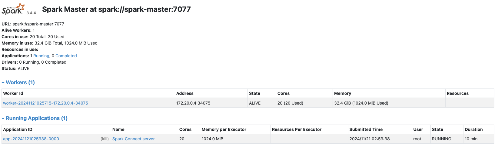
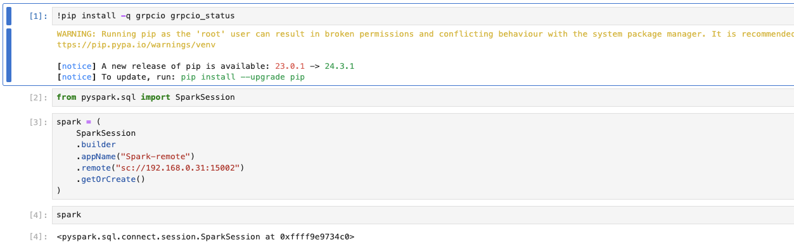
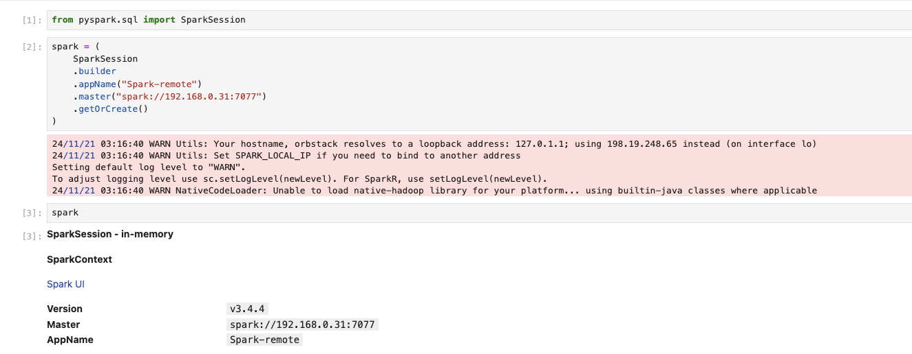
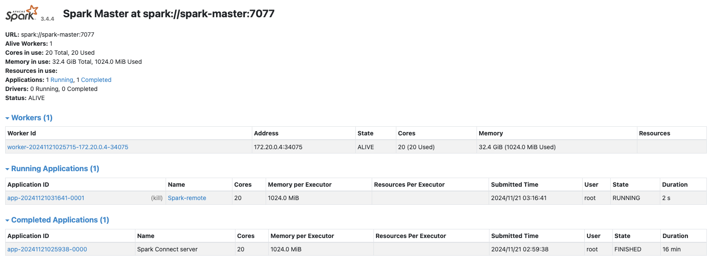

## 簡介

[Apache Spark](https://spark.apache.org/)是一個經典的分散式大數據處理工具。無論是資料處理或是模型訓練等等，均可藉由Spark來完成。Spark最重要的功能，也就是分散式的大數據處理能力，讓我們可以將複雜解大量的工作分配至各個節點來進行運算，加速數據處理的運算，提高數據管線的效率。在本篇文章中，我們將介紹如何使用Docker以及Docker Compose來架設Spark集群。

## 前置準備

在使用Docker建構Spark集群前，請確保以下工具已安裝完畢：

* Docker
* Docker Compose

此外，建議具備有Docker網路以及相關基礎知識，再進行Spark集群建構。

## 建構Docker映像檔案

### Dockerfile

為了建構Spark集群，首先我們需要建立一個Docker映像檔案。我們需要在`Dockerfile`中進行以下幾個操作來安裝Spark以及所需要的套件：

1. 透過`apt`安裝`openjdk`以及其他需要的工具
2. 設定安裝以及運作所需要的環境參數
3. 下載、解壓縮、以及安裝Spark
4. 準備`entrypoints.sh`來定義容器運作時的行為

以下是`Dockerfile`的內容：


```Dockerfile
FROM python:3.10-bullseye as spark-base

RUN apt-get update && \
    apt-get install -y --no-install-recommends \
      sudo \
      curl \
      vim \
      unzip \
      rsync \
      openjdk-11-jdk \
      build-essential \
      software-properties-common \
      ssh && \
    apt-get clean && \
    rm -rf /var/lib/apt/lists/*

ENV SPARK_HOME=${SPARK_HOME:-"/opt/spark"}
ENV HADOOP_HOME=${HADOOP_HOME:-"/opt/hadoop"}

RUN mkdir -p ${HADOOP_HOME} && mkdir -p ${SPARK_HOME}
WORKDIR ${SPARK_HOME}

RUN curl https://dlcdn.apache.org/spark/spark-3.4.4/spark-3.4.4-bin-hadoop3.tgz -o spark-3.4.4-bin-hadoop3.tgz \
 && tar xvzf spark-3.4.4-bin-hadoop3.tgz --directory /opt/spark --strip-components 1 \
 && rm -rf spark-3.4.4-bin-hadoop3.tgz

FROM spark-base as pyspark

COPY requirements.txt .
RUN pip3 install -r requirements.txt

ENV PATH="/opt/spark/sbin:/opt/spark/bin:${PATH}"
ENV SPARK_HOME="/opt/spark"
ENV SPARK_MASTER="spark://spark-master:7077"
ENV SPARK_MASTER_HOST spark-master
ENV SPARK_MASTER_PORT 7077
ENV PYSPARK_PYTHON python3

COPY config/spark-defaults.conf "$SPARK_HOME/conf"

RUN chmod u+x /opt/spark/sbin/* && \
    chmod u+x /opt/spark/bin/*

ENV PYTHONPATH=$SPARK_HOME/python/:$PYTHONPATH

COPY entrypoints.sh .

ENTRYPOINT ["./entrypoints.sh"]
```

除了`Dockerfile`以外，我們需要設定`entrypoints.sh`以及`spark-defaults.conf`以及`.env.spark`來定義容器的行為，以及設定部分Spark的參數。

### `entrypoints.sh`

在建構Spark集群時，我們需要容器扮演三種角色：`master`節點、`worker`節點以及`histroy-server`節點。我們可以透過將角色以參數的方式傳遞給`shell Script`，進而設定容器的運作行為：

```shell
#!/bin/bash

SPARK_WORKLOAD=$1

echo "SPARK_WORKLOAD: $SPARK_WORKLOAD"

if [ "$SPARK_WORKLOAD" == "master" ];
then
  start-master.sh -p 7077
elif [ "$SPARK_WORKLOAD" == "worker" ];
then
  start-worker.sh spark://spark-master:7077
elif [ "$SPARK_WORKLOAD" == "history" ]
then
  start-history-server.sh
fi
```

### `spark-defaults.conf`

`spark-defaults.conf`檔案是一種設定Spark參數的方法，你也可以透過使用環境參數的方式來進行定義。以下是我們的設定：

```text
spark.master                           spark://spark-master:7077
spark.eventLog.enabled                 false
spark.eventLog.dir                     /opt/spark/spark-events
spark.history.fs.logDirectory          /opt/spark/spark-events
```

在上方的設定中，我們設定了Spark的主節點連結，以及宣告了`eventLog`的相關參數，但我們在這邊可以暫時停用這項功能。

### `.env.spark`

透過`.env`檔案（即`.env.spark`）設定環境參數是在`Docker Compose`中比較推薦方式。以下是我們的示範設定，你可以自行新增而外的環境參數

```text
SPARK_NO_DAEMONIZE=true
```

### 建構映像檔

請使用下方的指令來進行映像檔的建立：

```shell
docker build -t <image name>:<image tag> . -f Dockerfile
```



在建立映像檔案時，請確保以下的檔案存在，以免造成錯誤：

entrypoints.sh
.env.spark
config/spark-default.conf
requirements.txt





由於我們在後續的docker-compose.yaml中使用了build-context的功能，可以直接讀取指定的映像檔案設定並進行映像檔的建構，故本步驟可以跳過。



## Docker Compose設定撰寫

接下來，我們將撰寫`Docker Compose`的設定，來定義我們的集群會有哪些資源跟容器。我們將設定一個`master`節點、一個`history-server`節點、以及`worker`節點。我們可以透過`docker compose`指令的`scale`參數來指定要部署幾個`worker`容器。對於各個容器做了哪些設定，請參考：

* 網路設定

我們為整個集群定義了一個名為`spark-network`的網路，所有在此網路內的容器均可以互相連通。

* Master容器

我們將`master`容器命名為`da-spark-master`，並利用`entrypoints.sh`使其作為主節點被啟動。我們掛載了`data`以及`spark_apps`資料夾至容器中，並掛載`spark-logs`容量作為紀錄使用。此外，我們也將宿主機的`9090`以及`7077`連接埠分別映射至容器的`8080`以及`7077`連接埠。我們也定義了`healthcheck`來確認容器的運作是否正常

* History Server節點

此節點的設定大致上與主要節點相同，使用`entrypoints.sh`定義其行為，並掛載容量作為資料存放使用，並映射了連接埠使外部可以存取到對應的資源。此外，我們使用了`depends_on`來使得History Server必須在主節點準備好後才進行建立。

* Worker節點

此節點的設定大致上與主要節點相同，使用`entrypoints.sh`定義其行為，並掛載容量作為資料存放使用。

```yaml
version: '3.8'

services:
  spark-master:
    container_name: da-spark-master
    build: 
      context: .
      dockerfile: Dockerfile
    entrypoint: ['./entrypoints.sh', 'master']
    healthcheck:
      test: [ "CMD", "curl", "-f", "http://localhost:8080" ]
      interval: 5s
      timeout: 3s
      retries: 3
    volumes:
      - ./data:/opt/spark/data
      - ./spark_apps:/opt/spark/apps
      - spark-logs:/opt/spark/spark-events
    env_file:
      - .env.spark
    ports:
      - '<your host IP>:9090:8080'
      - '<your host IP>:7077:7077'
    networks:
      - spark-network


  spark-history-server:
    container_name: da-spark-history
    build: 
      context: .
      dockerfile: Dockerfile
    entrypoint: ['./entrypoints.sh', 'history']
    env_file:
      - .env.spark
    volumes:
      - spark-logs:/opt/spark/spark-events
    ports:
      - '18080:18080'
    depends_on:
      - spark-master
    networks:
      - spark-network

  spark-worker:
    build: 
      context: .
      dockerfile: Dockerfile
    entrypoint: ['./entrypoints.sh', 'worker']
    depends_on:
      - spark-master
    env_file:
      - .env.spark
    volumes:
      - ./data:/opt/spark/data
      - ./spark_apps:/opt/spark/apps
      - spark-logs:/opt/spark/spark-events
    networks:
      - spark-network

volumes:
  spark-logs:

networks:
  spark-network:
```

## 啟動集群

藉由準備好的`docker-compse.yaml`，我們可以迅速地建立一個Spark集群。在建立集群前，請先將`spark-master`的`ports`設定修改，將`<your host IP>`設定成個人裝置的IP，避免建構失敗。

以下是建立集群的指令：

* 預設

```shell
docker-compose up -d
```

* 三個`worker`節點

```shell
docker-compose up -d --scale spark-worker=3
```

## 使用範例

### Cluster運作模式 + PySpark

如果需要使用Cluster模式，搭配PySpark來進行互動，需要先建立一個中轉容器，用以轉發PySpark所提交的任務。首先，我們需要額外建立一個容器，並在容器內啟動spark-connect-server:

```shell
docker run -it --network host --entrypoint="/bin/bash" <image name>:<image tag>
```

然後，在容器內執行以下指令：

```shell
start-connect-server.sh \
    --master spark:<your spark master ip>:<your spark master port> \
    --packages org.apache.spark:spark-connect_2.12:3.4.4 
```

觀察`spark-master`容器的`9090`連接埠所提供的網頁，可以注意到一個運作中的服務，此服務即為`spark-connect-server`所運作的服務。



接下來，我們可以在外部啟動一個`Jupyuter lab`，並透過此`spark-connect-server`所提供的中轉，進行Spark的操作：

```shell
docker run -it --network host --entrypoint="/bin/bash" <your jupyter lab image>
```

使用以下的程式碼來透過`spark-connect-server`建立與集群的連線：



### Client運作模式 + PySpark

我們也可以直接使用剛剛啟動的Jupyter lab，以Client模式進行運作。只要將Spark的連線改為以下的樣式即可：



同樣的，我們可以觀察網頁來確認新的連線：



可以注意到，有一個欄位是Spark-remote的連線，此連線就是我們剛剛建立的連線。

## 一些需要注意的地方

我們在這邊使用了`Docker Compose`來建構集群，然而在實務上，我們需要在不同的虛擬機或是實體機中架設Spark的容器並將他們建構成一個集群。`Docker Compose`雖然很好用，但他無法協助我們跨裝置進行管理以及建置。實務上需要透過其他方式來管理Spark集群，例如：`Zookeeper`、`Yarn`、`Messo`或是`k8s`等等支援多裝置資源調度的工具，才能更好的來去建構一個高可用性的Spark集群。

## 結語

在這篇文章中，我們簡單示範了如何使用`Docker Compose`來建構Spark的集群。我們省去了一些部分，例如關於資源的限制，以及如何去更細部的設定主節點以及Worker節點的細節。如果有興趣的話可以參考官方文件。下一篇Spark的文章我們將會介紹如何在K8s集群中架設Spark服務。

---

如果覺得我的文章對你有幫助，歡迎請我喝一杯咖啡～


<a href="https://www.buymeacoffee.com/ds_cafe_and_tips"></a>