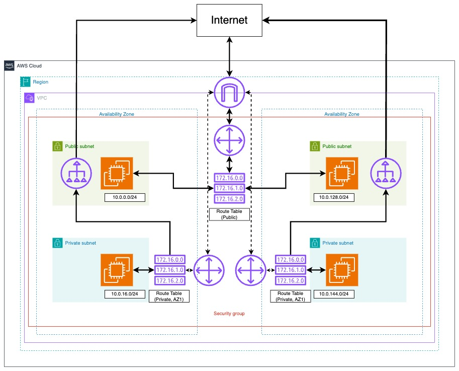
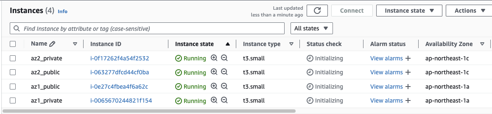
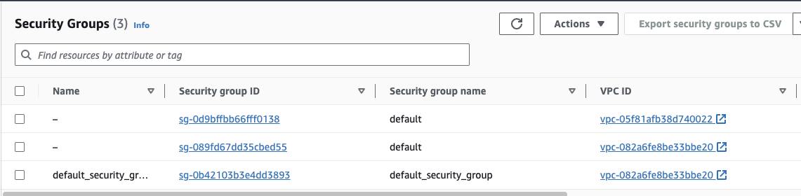
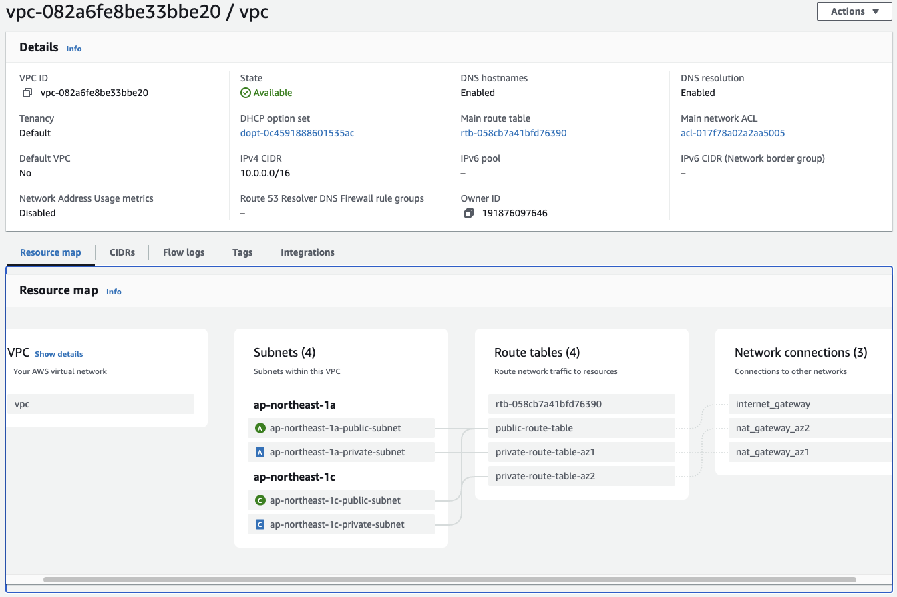

## 簡介

[Terrform](https://www.terraform.io/)是一個基礎設施即程式碼(Infrastructure as Code, IaC)的工具。透過Terraform，我們可以將設定環境以及基礎設施的流程，轉變成以程式碼的方式來進行設定。Terraform的一個好處是可以對應多元的環境，並且可以同時管理雲端以及地端的環境。同時，得利於以程式碼進行設定的風格，我們將可以把基礎設施的設定進行版本控制以及自動化。在這篇文章中，我們將示範如何使用Terraform進行AWS雲端環境的設定。

## 架構簡介

我們將在本文中，使用AWS雲端環境，在AWS日本的資料中心的兩個可用區域(Availablility Zone, AZ)之中，分別架構一組公開(Public)以及私有(Private)的子網(Subnet)，並納入同一個虛擬私人雲端(Virtaual Private CLoud, VPC)之中。在公開以及私有的子網中，我們將會分別設定一個EC2計算實體，並進行對應的網路限制。



以下是基本資訊：

* 區域(Region)：`ap-northeast-1`
* 可用區域：`ap-northeast-1a`、`ap-northeast-1c`
* 公開子網網段：`10.0.0.0/24`(`ap-northeast-1a`)、`10.0.128.0/24`(`ap-northeast-1c`)
* 私有子網網段：`10.0.16.0/24`(`ap-northeast-1a`)、`10.0.144.0/24`(`ap-northeast-1c`) 

## 前置準備

在開始閱讀此範例之前，請先確定你已經完成以下前置準備：

1. 安裝Terraform工具
2. 將[AWS管理工具](https://registry.terraform.io/providers/hashicorp/aws/latest)作為`provider`加入到Terraform專案之中
3. 一組可用的`assess_key`以及`secret_key`，用以存取AWS雲端的控制API

若還沒有安裝Terraform，可以參考上一篇[文章](https://dstipscafe.github.io/blogs/p/terraform_intro/)。此外，請參考AWS管理工具的[教學](https://registry.terraform.io/providers/hashicorp/aws/latest/docs)進行設定。

## 設定VPC

作為整個環境的核心，我們需要設定一個VPC將兩個位於不同可用區域的各個公開以及私有子網整合在一個網路環境之中。要設定一個VPC，可以使用`aws_vpc`資源進行設定：

```
variable "vpc_cidr" {
  default = "10.0.0.0/16"
}

resource "aws_vpc" "vpc" {
  cidr_block = var.vpc_cidr
  enable_dns_hostnames = true
  enable_dns_support   = true

  tags = {
    Name = "vpc"
  }
}
```

在上方的設定中，我們設定了一個變數`vpc_cidr`來代表VPC的IP範圍，並利用這個變數來設定`aws_vpc`資源。



我們使用`tag`來對資源進行命名，這是aws管理工具的命名方式，我們後續也將使用此方法為其他資源進行命名。




## 設定子網

在設定好VPC之後，我們可以開始進行子網的設定。按照計劃，我們將在兩個可用區域中，分別設定一組公開以及私有的子網。在開始進行設定之前，我們可以使用`locals`物件來設定變數，分別代表兩個可用區域的代號。另外，我們也將使用變數來定義公開子網以及私有子網的IP範圍。

```
variable "aws_region" {
  default = "ap-northeast-1"
}

variable "public_subnets_cidr" {
  type        = list(any)
  default     = ["10.0.0.0/24", "10.0.128.0/24"]
  description = "CIDR block for Public Subnet"
}

variable "private_subnets_cidr" {
  type        = list(any)
  default     = ["10.0.16.0/24", "10.0.144.0/24"]
  description = "CIDR block for Private Subnet"
}

locals {
  availability_zones = ["${var.aws_region}a", "${var.aws_region}c"]
}

```

接下來，我們將進行兩個可用區域中，各種子網的設定。在開始設定公開子網之前，我想先介紹一下Terraform的`length`以及`element`功能。Terraform提供的`length`功能，可以取得字串(string)以及列表(list)的長度；而`element`功能則可以使用`index`來取得列表中對應的元素。接下來我們將使用`length`以及`element`的功能結合，快速建立公開以及私有的子網。

### 設定公開子網

在設定子網時，需要提供幾個訊息：

* 子網所對應的VPC
* 子網的ID範圍
* 子網的可用區域

以下是公開子網資源的設定。

```
resource "aws_subnet" "public_subnet" {
  vpc_id = aws_vpc.vpc.id
  count = length(var.public_subnets_cidr)
  cidr_block = element(var.public_subnets_cidr, count.index)
  availability_zone = element(local.availability_zones, count.index)

  map_public_ip_on_launch = true

  depends_on = [ aws_vpc.vpc ]

  tags = {
    Name        = "${element(local.availability_zones, count.index)}-public-subnet"
  }
}
```

在其中，`map_public_ip_on_launch`設定的作用為判斷在實體建立時，就指定公開的IP與否，由於是公開的子網，所以我們會將此設定為`true`來讓實體可以取的公開的IP。另外，`depends_on`為Terraform內建功能，其作用為先後順序管理。在這裏，當`aws_vpc.vpc`資源設定完成後，才進行此公開子網的設定。

### 設定私有子網

私有子網的設定部分，與公開子網很類似，唯一的區別是我們會將`map_public_ip_on_launch`設定為`false`，並使用先前宣告的私有子網IP範圍進行設定。

```
resource "aws_subnet" "private_subnet" {
  vpc_id = aws_vpc.vpc.id
  count = length(var.private_subnets_cidr)
  cidr_block = element(var.private_subnets_cidr, count.index)
  availability_zone = element(local.availability_zones, count.index)
 
  map_public_ip_on_launch = false

  depends_on = [ aws_vpc.vpc ]

  tags = {
    Name        = "${element(local.availability_zones, count.index)}-private-subnet"
  }
}

```

## 設定網路匝道

在完成公開以及私有子網的設定後，接下來我們需要設定網路匝道。對於公開子網，我們將允許其內部的資源直接被外部的網路所存取（基於防火牆設定之上）；對於私有子網，我們允許這個子網內的資源存取外部網路，但不允許外部網路的訪問直接存取到私有子網內的資源。對與此需求，我們需要分別為公開子網以及私有子網設定**網際網路匝道(Internat Gateway)**以及**NAT匝道(NAT Gateway)**。這兩種網路匝道的差異如下：

* 網際網路匝道：網際網路匝道允許雙向的存取，資源可以透過此匝道直接存取外部資源，而外部資源也可以透過此匝道存取到內部的資源。
* NAT匝道：未擁有公開IP位置的資源，無法直接存取外部的資源，但可以透過NAT匝道來進行轉址，來對外部資源進行訪問。

> 可以參考這篇[文章](https://medium.com/@awseducate.cloudambassador/%E6%8A%80%E8%A1%93%E5%88%86%E4%BA%AB-internet-gateway-%E5%92%8C-nat-gateway-%E7%9A%84%E5%8D%80%E5%88%A5%E5%9C%A8%E5%93%AA-%E5%8A%9F%E8%83%BD%E5%88%86%E5%88%A5%E6%98%AF%E4%BB%80%E9%BA%BC-b676f62b1d31)來獲取更詳細的介紹。

### 設定網際網路匝道

網際網路匝道的設定相當簡單，只需要將此匝道與VPC進行關聯即可。

```
resource "aws_internet_gateway" "ig" {
  vpc_id = aws_vpc.vpc.id

  depends_on = [ aws_vpc.vpc ]

  tags = {
    Name = "internet_gateway"
  }
}
```

### 設定NAT匝道

設定NAT匝道前，需要先準備一組彈性IP地址，提供NAT匝道使用。在透過將此Elastic IP與NAT匝道以及VPC進行關聯，即可完成設定。由於我們有兩個可用區域，所以我們將會設定兩組Elastic IP以及NAT匝道。

```
resource "aws_eip" "nat_eip_az1" {
  domain = "vpc"
  depends_on = [ aws_vpc.vpc ]
}

resource "aws_nat_gateway" "nat_az1" {
  allocation_id = aws_eip.nat_eip_az1.id
  subnet_id = element(aws_subnet.public_subnet.*.id, 0)

  depends_on = [ aws_eip.nat_eip_az1 ]

  tags = {
    Name = "nat_gateway_az1"
  }
}

resource "aws_eip" "nat_eip_az2" {
  domain = "vpc"
  depends_on = [ aws_vpc.vpc ]
}

resource "aws_nat_gateway" "nat_az2" {
  allocation_id = aws_eip.nat_eip_az2.id
  subnet_id = element(aws_subnet.public_subnet.*.id, 1)

  depends_on = [ aws_eip.nat_eip_az2 ]

  tags = {
    Name = "nat_gateway_az2"
  }
}

```

## 設定路由以及路由表

在先前的部分中，我們設定了網路匝道以及NAT匝道，接下來我們需要設定路由表以及對應的路由來讓流量可以依照我們希望的去進行運作。路由表是一個可以讓你控制流量該如何被處理的存在，而路由則是路由表之中的細部設定。在訂好路由表以及路由之後，我們需要設定路由表關聯(Route Table Association)來將路由、路由表以及子網進行配對。

### 設定路由表

接下來，我們將設為公開子網以及私有子網設定路由表。公開子網的部分，只需要設定一個路由表並對應至兩個公開子網即可。而對於私有子網的部分，因為每個可用區域有自己對應的NAT匝道，所以需要分別建立路由表，確保可用區域的流量將會從可用區域內的NAT匝道進出。以下是路由表的設定：

```
# Routing tables to route traffic for Private Subnet
resource "aws_route_table" "private_az1" {
  vpc_id = aws_vpc.vpc.id

  depends_on = [ aws_vpc.vpc ]

  tags = {
    Name        = "private-route-table-az1"
  }
}

resource "aws_route_table" "private_az2" {
  vpc_id = aws_vpc.vpc.id

  depends_on = [ aws_vpc.vpc ]

  tags = {
    Name        = "private-route-table-az2"
  }
}

# Routing tables to route traffic for Public Subnet
resource "aws_route_table" "public" {
  vpc_id = aws_vpc.vpc.id

  depends_on = [ aws_vpc.vpc ]

  tags = {
    Name        = "public-route-table"
  }
}

```

### 設定路由

接下來，我們將進行路由的設定。對於公開子網，我們允許其透過網際網路匝道存取外部的任意資源，意即`0.0.0.0/0`。對於兩個私有子網，我們同樣允許對外部資源的任意存取，但必須透過對應的NAT匝道。以下是設定：

```
resource "aws_route" "public_internet_gateway" {
  route_table_id         = aws_route_table.public.id
  destination_cidr_block = "0.0.0.0/0"
  gateway_id             = aws_internet_gateway.ig.id
}

resource "aws_route" "private_internet_gateway_az1" {
  route_table_id         = aws_route_table.private_az1.id
  destination_cidr_block = "0.0.0.0/0"
  nat_gateway_id      = aws_nat_gateway.nat_az1.id
}

resource "aws_route" "private_internet_gateway_az2" {
  route_table_id         = aws_route_table.private_az2.id
  destination_cidr_block = "0.0.0.0/0"
  nat_gateway_id      = aws_nat_gateway.nat_az2.id
}

```

### 設定路由表關聯

我們已經完成了路由以及路由表的設定，接下來我們需要透過**路由表關聯**來將這些規則與子網進行關聯。對於公開子網，我們可以透過`length`以及`element`進行設定，而私有子網則各自設定：

```
resource "aws_route_table_association" "public" {
  count          = length(var.public_subnets_cidr)
  subnet_id      = element(aws_subnet.public_subnet.*.id, count.index)
  route_table_id = aws_route_table.public.id
}

resource "aws_route_table_association" "private_az1" {
  subnet_id      = element(aws_subnet.private_subnet.*.id, 0)
  route_table_id = aws_route_table.private_az1.id
}

resource "aws_route_table_association" "private_az2" {
  subnet_id      = element(aws_subnet.private_subnet.*.id, 1)
  route_table_id = aws_route_table.private_az2.id
}

```

透過以上的設定，我們就可以將路由表、路由以及對應的子網進行關聯，並使得對內以及對外的流量可以依照我們所期待的去運作。

## 休息一下

在以上的章節中，我們已經完成了關於網路方面的設定。接下來我們可以實際部署AWS EC2運算實體，並驗證我們的網路設置是否正確。在設定運算實體之前，需要設定安全群組(Security Group)來管控對內以及對外的防火牆規則。

## 設定安全群組

安全群組是AWS雲端環境中控制網路流量的重要功能。在這個示範中，我們將VPC內的所有網路資源置於同一個安全群組之中。對於安全群組，還需要進行細部的對內(Inbound)以及對外(Outbound)
流量規則設定。在這裡，我們將允許地端的開發環境，以及區域內和同安全群組內的流量進入；另外，我們將允許安全群組內的資源存取任意的外部資源，以及對相同安全群組的資源存取。以下是設定：

### 設定安全群組
```
resource "aws_security_group" "default_security_group" {
  name = "default_security_group"

  vpc_id = aws_vpc.vpc.id

  tags = {
    Name = "default_security_group"
  }
}
```

### 設定對內流量限制

```
resource "aws_vpc_security_group_ingress_rule" "default_ingress_aws" {
  security_group_id = aws_security_group.default_security_group.id
  cidr_ipv4 = "3.112.23.0/29"
  from_port = 22
  ip_protocol = "tcp"
  to_port = 22
}

resource "aws_vpc_security_group_ingress_rule" "default_ingress_local" {
  security_group_id = aws_security_group.default_security_group.id
  cidr_ipv4 = "220.134.96.6/32"
  from_port = 22
  ip_protocol = "tcp"
  to_port = 22
}
```

### 設定對外流量限制

```
resource "aws_vpc_security_group_egress_rule" "default_egress_rule" {
  security_group_id = aws_security_group.default_security_group.id
  cidr_ipv4 = "0.0.0.0/0"
  ip_protocol = -1
}
```

### 設定同群組的對內以及對外流量限制

```
resource "aws_vpc_security_group_ingress_rule" "default_same_sg_connection_ingress" {
  security_group_id = aws_security_group.default_security_group.id
  referenced_security_group_id = aws_security_group.default_security_group.id
  ip_protocol = -1

}

resource "aws_vpc_security_group_egress_rule" "default_same_sg_connection_egress" {
  security_group_id = aws_security_group.default_security_group.id
  referenced_security_group_id = aws_security_group.default_security_group.id
  ip_protocol = -1

}

```

在這些設定完成後，將允許群組內的互相存取、部分VPC外部的資源存取，以及對外部的任意存取。

## 設定運算實體

接下來，我們將部署往四個子網內各部署一個運算實體。在部署運算實體之前，需要使用Terraform的`data`物件來宣告一個`Amazon Machine Image(AMI)`物件以利後續使用：

### 設定AMI

在Terraform的AWS管理工具中，提供了透過`data`物件設定AMI的功能。以下是設定一個ubuntu的範例。

```
data "aws_ami" "ubuntu" {
  most_recent = true

  filter {
    name   = "name"
    values = ["ubuntu/images/hvm-ssd/ubuntu-jammy-22.04-amd64-server-*"]
  }

  filter {
    name   = "virtualization-type"
    values = ["hvm"]
  }

  owners = ["099720109477"] # Canonical

}

```

### 設定運算實體

接下來，我們將使用設定好的`aws_ami`物件建立四個運算實體。我們將使用`t3.samll`的EC2實體，並將每一個運算實體對應到同一個安全群組，以及對應的子網。以下是設定：

```
resource "aws_instance" "az1_public" {
  ami = data.aws_ami.ubuntu.id

  instance_type = "t3.small"

  subnet_id = aws_subnet.public_subnet[0].id

  vpc_security_group_ids = [aws_security_group.default_security_group.id]

  key_name = var.ssh_key

  depends_on = [ aws_subnet.public_subnet, aws_subnet.private_subnet]

  tags = {
    Name = "az1_public"
  }

}

resource "aws_instance" "az1_private" {
  ami = data.aws_ami.ubuntu.id

  instance_type = "t3.small"

  subnet_id = aws_subnet.private_subnet[0].id

  security_groups = [aws_security_group.default_security_group.id]

  key_name = var.ssh_key

   depends_on = [ aws_subnet.private_subnet ]

  tags = {
    Name = "az1_private"
  }

}

resource "aws_instance" "az2_public" {
  ami = data.aws_ami.ubuntu.id

  instance_type = "t3.small"

  subnet_id = aws_subnet.public_subnet[1].id

  vpc_security_group_ids = [aws_security_group.default_security_group.id]

  key_name = var.ssh_key

  depends_on = [ aws_subnet.public_subnet, aws_subnet.private_subnet]


  tags = {
    Name = "az2_public"
  }

}

resource "aws_instance" "az2_private" {
  ami = data.aws_ami.ubuntu.id

  instance_type = "t3.small"

  subnet_id = aws_subnet.private_subnet[1].id

  security_groups = [aws_security_group.default_security_group.id]

  key_name = var.ssh_key

  depends_on = [ aws_subnet.private_subnet ]

  tags = {
    Name = "az2_private"
  }

}
```

在設定中，可以注意到一個`key_name`，這是AWS EC2的功能中，託管SSH金鑰的功能。礙於篇幅，我們在本文章中不會介紹。此功能是將公鑰放置於AWS環境中，並讓運算實體可以使用先載入此公鑰的功能。

## 套用設定

在完成設定後，我們可以使用以下指令來將這些設定套用至AWS雲端環境之中。

```shell
terraform plan
terraform apply
```

## 檢視成果

在完成設定後，可以在AWS的控制面板中檢視成果。以下是成果截圖：







可以從上方的截圖中，注意到我們設定的所有資源都正常的被部署到了環境之中。礙於篇幅，我們就不將網路測試的部分展示在此文之中，如果網路部分有問題，歡迎留言討論。


## 結語

在這篇文章中，我們示範了如何使用Terraform設定AWS環境，並實際進行部署。雖然我們在本文章中，對每個資源進行了手動設定，但在社群中，有可以更方便的[VPC設定工具](https://github.com/terraform-aws-modules/terraform-aws-vpc)可以協助使用者進行VPC的設定。

## 參考資料

1. How to Build AWS VPC Using Terraform - Step By Step: https://dev.to/aws-builders/how-to-build-aws-vpc-using-terraform-step-by-step-3k7f
2. 【技術分享】Internet Gateway 和 NAT Gateway 的區別在哪? 功能分別是什麼?：https://medium.com/@awseducate.cloudambassador/%E6%8A%80%E8%A1%93%E5%88%86%E4%BA%AB-internet-gateway-%E5%92%8C-nat-gateway-%E7%9A%84%E5%8D%80%E5%88%A5%E5%9C%A8%E5%93%AA-%E5%8A%9F%E8%83%BD%E5%88%86%E5%88%A5%E6%98%AF%E4%BB%80%E9%BA%BC-b676f62b1d31
3. AWS - NAT 閘道：https://docs.aws.amazon.com/zh_tw/vpc/latest/userguide/vpc-nat-gateway.html
4. AWS - 安全群組：https://docs.aws.amazon.com/zh_tw/vpc/latest/userguide/vpc-security-groups.html
5. Terraform - Element：https://developer.hashicorp.com/terraform/language/functions/element


<a href="https://www.buymeacoffee.com/ds_cafe_and_tips"></a>